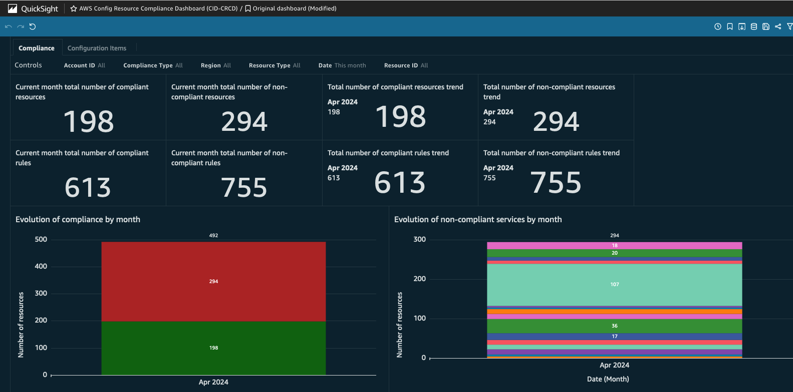
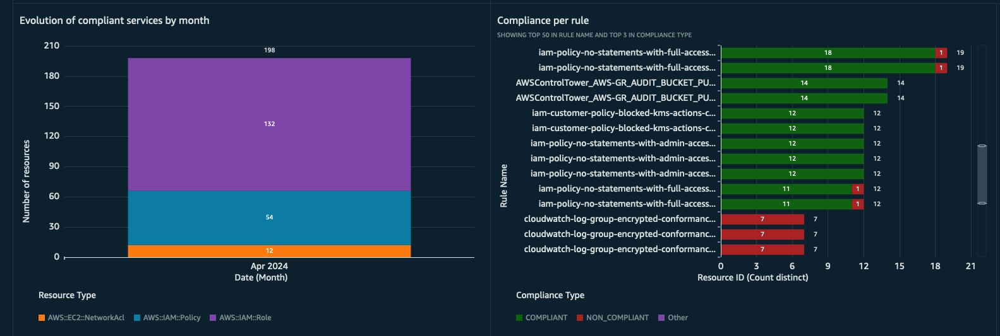
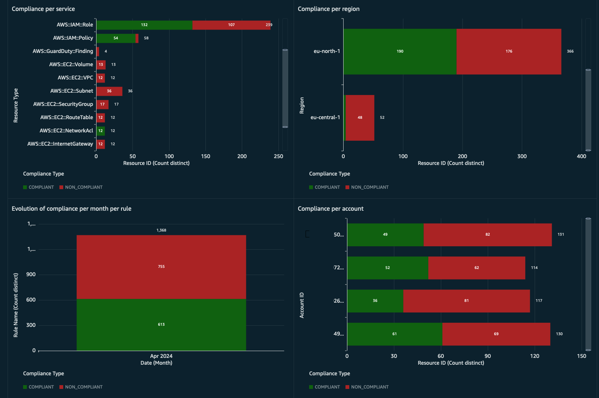
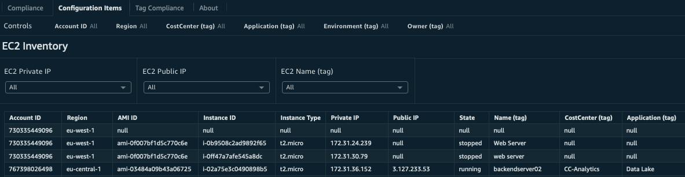
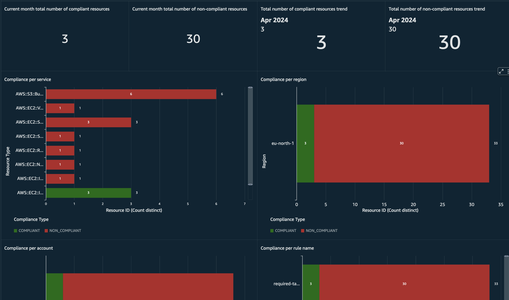
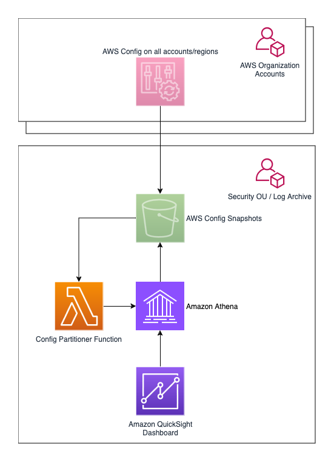

# Cloud Intelligence Dashboards - AWS Config Resource Compliance Dashboard (CRCD) v2.0.0

## Description






The AWS Config Resource Compliance Dashboard (CRCD) shows the inventory of resources, along with their compliance status, running across multiple AWS accounts. The dashboard provides:

- Month-by-month evolution of the compliance status of your resources
- Breakdown of compliance per service, account and region
- Compliance of AWS Config Rules and Conformance Packs
- Inventory of Amazon EC2, Amazon S3 and Amazon Relational Database Service (RDS) resources with filtering on account, region, customizable tags
- A deep dive on tagging compliance

The dashboard uses these sources to get these insights:

- AWS Config Configuration Snapshots: to get the inventory of resources and their compliance with AWS Config Rules and Conformance Packs using Configuration Snapshots

The infrastructure needed to collect and process the data is defined in CloudFormation. 

### Custom tags support


The dashboard allows filtering of resources by the custom tags that you use to categorize workloads. The name of the tags will be provided by you during installation.

### Tag compliance
Tag compliance collects the results of AWS Config Managed Rule [required-tags](https://docs.aws.amazon.com/config/latest/developerguide/required-tags.html). You can activate this rule as many times as needed, just give it a name that starts with `required-tags`.



## Architecture



The solution can be deployed in standalone AWS accounts and AWS accounts that are member of an AWS Organization. In both cases, AWS Config is configured to deliver Configuration Snapshots to a centralized S3 bucket on a dedicated Log Archive account. Whenever there's a new object in the bucket, the Lambda Config Partitioner function is triggered. This function checks if the object is a Configuration Snapshot, and adds a new partition to the corresponding Athena table with the new data. If the object is not a Configuration Snapshot, the function ignores it. 

For more information on how the Lambda Partitioner function recognizes Configuration Snapshots, see [Amazon S3 prefixes for AWS Config objects](README.md#amazon-s3-prefixes-for-aws-config-objects).

An Amazon Athena table is used to extract data from Configuration Snapshots. The solution provides Athena views, which are SQL queries that extract data from S3 using the schema defined in the previously mentioned table. Finally, you can visualize the data in a QuickSight dashboard that use these views through Amazon QuickSight datasets.

If you install the dashboard on an account part of an AWS Organization, this must be done on the same Log Archive account that contains the Amazon S3 bucket where your AWS Config Configuration Snapshots are delivered. Alternatively, you can install the dashboard on a dedicated Dashboard Account, but you'll have to replicate AWS Config Configuration Snapshots across accounts to a local Amazon S3 bucket. This will be explained in the optional step in the installation instructions.


## Regional considerations
**Data transfer costs will incur when Amazon Athena queries an Amazon S3 bucket across regions.**

To avoid cross-region data transfer, Amazon Quicksight and the Amazon S3 bucket that centrally collects AWS Config Configuration Snapshots must be deployed in the same region. 

If you have already deployed either one of the resources, the other must use the same region. If you haven't deployed anything yet, you can chose a region of your preference. If you have deployed both resources in different regions, we strongly recommend making changes so that both are in the same region.

Once you have decided the region, AWS resources supporting the dashboard (deployed via CloudFormation) must be deployed in the same region.

## Prerequisites
 
1. AWS Config enabled in the accounts and regions you want to track, setup the delivery of AWS Config Configuration Snapshots to a centralized S3 bucket in the Log Archive account
   1. If you do not have AWS Config enabled, follow [these instructions](https://aws.amazon.com/blogs/mt/managing-aws-organizations-accounts-using-aws-config-and-aws-cloudformation-stacksets/) to use AWS CloudFormation StackSets to enable AWS Config on all member accounts under organizational units in a single execution

1. An AWS Account where you'll deploy the dashboard (the Dashboard Account)
1. IAM Role or IAM User with permissions to deploy the infrastructure using CloudFormation
1. Sign up for [Amazon QuickSight](https://docs.aws.amazon.com/quicksight/latest/user/signing-up.html) and create a user:
    1. Select **Enterprise** edition
    2. Paginated Reports are not required for the CRCD dashboard. On the **Get Paginated Report add-on** choose the option you prefer
    3. **Use IAM federated identities and QuickSight-managed users**
    4. Select the region where to deploy the dashboard. We recommend using the same region of your Amazon S3 bucket
    5. Add an username and an e-mail where you'll receive notifications about failed QuickSight datasets updates
    6. Use the **QuickSight-managed role (default)**
    7. Don't modify the **Allow access and autodiscovery for these resources** section and click on **Finish**
1. Ensure you have SPICE capacity left in the region where you're deploying the dashboard


## Deployment Instructions 

### Optional Step (installation on dedicated Dashboard Account)

Follow this optional step if you want to install the AWS Config Resource Compliance Dashboard (CRCD) on a Dashboard Account separated from the Log Archive account. In this case, the architecture of the solution is below.


**Skip to the next paragraph to install the dashboard directly on the Log Archive account.**

For this scenario it is necessary to configure object replication from the centralized Amazon S3 Config bucket in the Log Archive account (the source bucket), to an Amazon S3 bucket that you will create in the Dashboard Account (the destination bucket).

Log onto the Dashboard Account, open the Amazon S3 console and create an Amazon S3 bucket in the region where you will deploy the dashboard, make sure to activate versioning. From now on, this will be called the **Data Collection Bucket**. 

Now log onto the Log Archive Account and open the Amazon S3 console. You can replicate AWS Config Configuration Snapshots from the centralized Amazon S3 Config Snapshots bucket to the Data Collection Bucket through an Amazon S3 Replication configuration, follow the instructions [here](https://docs.aws.amazon.com/AmazonS3/latest/userguide/replication-walkthrough-2.html). Once you create the replication configuration on the source bucket, write down the ARN of the IAM role created for the replication. Amazon S3 assumes this IAM role to replicate objects across accounts on your behalf.

After you created the Replication Configuration, you need to modify the Bucket Policy of the Data Collection Bucket in the destination account to allow the source account to replicate S3 objects. 

Replace `SOURCE_ACCOUNT_REPLICATION_ROLE_ARN` and `DESTINATION_BUCKET_ARN` in the policy below with the corresponding values, and add the policy to the Data Collection Bucket using the AWS Console.

```
{
    "Version":"2012-10-17",
    "Id":"",
    "Statement":[
      {
         "Sid": "HTTPSOnly",
         "Effect": "Deny",
         "Principal": "*",
         "Action": "s3:*",
         "Resource": [
             "DESTINATION_BUCKET_ARN/*",
             "DESTINATION_BUCKET_ARN"
         ],
         "Condition": {
             "Bool": {
                 "aws:SecureTransport": "false"
             }
         }
      },
      {
         "Sid":"Set permissions for objects",
         "Effect":"Allow",
         "Principal":{
            "AWS":"SOURCE_ACCOUNT_REPLICATION_ROLE_ARN"
         },
         "Action":["s3:ReplicateObject", "s3:ReplicateDelete"],
         "Resource":"DESTINATION_BUCKET_ARN/*"
      },
      {
         "Sid":"Set permissions on bucket",
         "Effect":"Allow",
         "Principal":{
            "AWS":"SOURCE_ACCOUNT_REPLICATION_ROLE_ARN"
         },
         "Action":["s3:List*", "s3:GetBucketVersioning", "s3:PutBucketVersioning"],
         "Resource":"DESTINATION_BUCKET_ARN"
      }
    ]
 }
```

You can follow [these instructions](https://docs.aws.amazon.com/AmazonS3/latest/userguide/add-bucket-policy.html) for that.

Once object replication is configured, follow the instructions on the next paragraph. In your case, the Amazon S3 bucket will always be the Data Collection Bucket.

## Deployment Steps

1. At every step, make sure you are in the region where both your central Config Amazon S3 bucket Amazon QuickSight are deployed.
1. Open the CloudFormation console and upload the template file `cloudformation/cid-crcd-resources.yaml`. Specify these parameters:
   - `Stack name` This is up to you, but we recommend to call it `cid-crcd-resources`
   - `QuickSightUser` User name of QuickSight user (as displayed in QuickSight admin panel), see [here](https://quicksight.aws.amazon.com/sn/admin#users)
   - `ConfigLoggingBucket` Name of the Amazon S3 bucket that collects AWS Config data
   - `ConfigLoggingAccountID` This is the 12-digit number of the current account 
   - **Leave every other parameter to its default value**
1. Run the template.
1. Write down the following from the output of the CloudFormation template:
   - `LambdaARN`
   - `LambdaRoleARN`
   - `QuickSightDataSourceRole`
1. Deploy QuickSight Dashboard using the [CID-CMD](https://github.com/aws-samples/aws-cudos-framework-deployment) tool:
   - Navigate to the AWS Console and open AWS CloudShell. Be sure to be in the correct region
   - The tool requires Python 3
   - Make sure you have the latest pip package installed:
    ```
    python3 -m ensurepip --upgrade
    ```
   - Install the CID-CMD tool running the following command:
    ```
    pip3 install --upgrade cid-cmd
    ```
   - On the top right corner, click on `Actions`, and then `Upload file`
   - Select the `CID-Config.yaml` file under the `dashboard_template` directory and click on `Upload`
   - Deploy the dashboard running the command (replace first the following parameters):
     - `--s3path` The full path of the Amazon S3 bucket that contains your AWS Config logs, eg: `s3://my-config-logs-bucket/` be sure it ends with a forward slash `/`
     - `--quicksight-datasource-role` The value of the output `QuickSightDataSourceRole` from the CloudFormation template
     - `--tag1` The name of the first tag you use to categorize workloads
     - `--tag2` The name of the second tag you use to categorize workloads
     - `--tag3` The name of the third tag you use to categorize workloads
     - `--tag4` The name of the fourth tag you use to categorize workloads
     - Notice that tag parameters are case sensitive and cannot be empty. If you do not use a tag, pass a short default value, e.g. `--tag4 'tag4'`
     - **Leave every other parameter to its default value**

    ```
    cid-cmd deploy --resources 'cid-crcd.yaml' --s3path 'REPLACE-WITH-S3-CONFIG-BUCKET' --quicksight-datasource-role 'REPLACE-WITH-CLOUDFORMATION-OUTPUT' --tag1 'REPLACE_WITH_CUSTOM_TAG_1' --tag2 'REPLACE_WITH_CUSTOM_TAG_2' --tag3 'REPLACE_WITH_CUSTOM_TAG_3' --tag4 'REPLACE_WITH_CUSTOM_TAG_4' --dashboard-id 'cid-crcd' --athena-database 'cid_crcd_database'  --athena-workgroup 'cid-crcd-dashboard'
    ```
1. During installation the CID-CMD tool will ask you `[quicksight-datasource-id] Please choose DataSource (Select the first one if not sure): (Use arrow keys)` If you have installed other CID/CUDOS dashboards, you already have a datasource called `CID-CMD-Athena`. Select it, otherwise select `CID-CMD-Athena <CREATE NEW DATASOURCE>`
1. When asked `[timezone] Please select timezone for datasets scheduled refresh.: (Use arrow keys)` select the time zone for dataset scheduled refresh in your region (it is already preselected)
1. When asked `[share-with-account] Share this dashboard with everyone in the account?: (Use arrow keys)` select the option that works for you
1. Enable Refresh Schedule on Datasets. This will refresh the data in QuickSight with the frequency you specify:
   - Navigate to QuickSight and then Datasets
   - The datasets for this dashboard have all the `config_` prefix
   - Click on a Dataset, and then open the Refresh tab
   - Click on Add a new schedule, select Full refresh and a Frequency

1. Configure the Config S3 bucket to trigger the Lambda Partitioner function when objects are added to the bucket and allow the same function permission to read objects:
   - Enable a Lambda event notification [follow these instructions](https://docs.aws.amazon.com/AmazonS3/latest/userguide/enable-event-notifications.html#enable-event-notifications-sns-sqs-lam) so that the Lambda Partitioner function will be called every time a new Config Snapshot is available. Use the following parameters:
     - Name = `cid-crcd-deliver-config-snapshot`
     - Event types = `All object create events`
     - Destination = `Lambda function`
     - Click on `Choose from your Lambda functions` and select the lambda function `cid-crcd-config-snapshot-partitioner` from the drop down list
     - Alternatively, select `Enter Lambda function ARN` and enter the value of the output `LambdaARN` returned by the CloudFormation script on the `Lambda function` field
   - Add the following statement to the bucket policy [follow these instructions](https://docs.aws.amazon.com/AmazonS3/latest/userguide/add-bucket-policy.html):
     - Replace `LAMBDA-PARTITIONER-RULE-ARN` with the output `LambdaRoleARN` returned by the CloudFormation script
     - Replace `YOUR-CONFIG-BUCKET` with the name of the Config S3 bucket

    ```
        {
            "Sid": "Lambda Partitioner access for CRCD dashboard",
            "Effect": "Allow",
            "Principal": {
                "AWS": "LAMBDA-PARTITIONER-ROLE-ARN"
            },
            "Action": [
				"s3:GetBucketLocation",
				"s3:GetObject",
				"s3:ListBucket",
				"s3:GetObjectVersion"
			],
            "Resource": [
                "arn:aws:s3:::YOUR-CONFIG-BUCKET",
                "arn:aws:s3:::YOUR-CONFIG-BUCKET/*"
            ]
        }
    ```

> The code in the Lambda Partitioner function supports this advanced scenario.
> * If your bucket publishes events notifications to an SNS topic, you can subscribe the Lambda Partitioner function to the topic.
> * If your bucket already sends event notifications to a lambda function, you can change that notification to an SNS topic and subscribe your function and the Lambda Partitioner function to that SNS topic.


1. Visualize the dashboard:
   - Navigate to QuickSight and then Dashboards
   - Make sure you are in the correct region
   - Click on the **AWS Config Resource Compliance Dashboard (CRCD)** dashboard


## Destroy resources

In order to destroy the dashboard, you need to:

1. Navigate to the AWS Console and open AWS CloudShell in the region where you have deployed the dashboard
1. Delete the dashboard by executing the following command:

```
cid-cmd delete --resources cid-crcd.yaml
```

Where:

* `cid-crcd.yaml` is the template file provided in `dashboard_template` directory (upload it to CloudShell if needed)

3. When prompted:
   - Select the `[cid-crcd] AWS Config Resource Compliance Dashboard (CRCD)` dashboard
   - For each QuickSight dataset, choose `yes` to delete the dataset
   - Accept the default values of the S3 Path for the Athena table.
   - For each Athena view, choose `yes` to delete the dataset

1. On the same account, open CloudFormation and delete the template that installed the resources for the dashboard (make sure to empty the Amazon S3 bucket hosting the Athena Query results first)
1. Revert any manual change done during setup:
   - Amazon S3 Config Logging Bucket: remove the bucket policy statement that allows the Lambda Partitioner function to read objects
   - Amazon S3 Config Logging Bucket: remove the Event notification that triggered the  Lambda Partitioner function
   - If you configured replication for the Config objects across accounts, remove the destination bucket and the replication configuration.

# Additional Information

## Amazon S3 prefixes for AWS Config objects
The solution supports the following ways of activating AWS Config:
1. manual setup on standalone AWS accounts
1. deployment by AWS Control Tower on AWS Organizations

These two options have different ways of structuring the prefixes of the AWS Config Configuration Snapshots on Amazon S3. They are defined below, and the Lambda Partitioner function supports all of them.

**Verify that your setup is compatible with the Amazon S3 prefixes.** If not, the Lambda Partitioner function will not be able to recognize objects as valid AWS Config Configuration Snapshots and will discard them. As a consequence, your Athena table will be empty.


### Supported AWS Config prefixes on Amazon S3

#### Manual AWS Config setup 
`AWSLogs/ACCOUNT-ID/Config/REGION/YYYY/MM/DD/ConfigSnapshot/ACCOUNT-ID_Config_REGION_ConfigSnapshot_TIMESTAMP_RANDOM.json.gz`

`AWSLogs/ACCOUNT-ID/Config/REGION/YYYY/MM/DD/ConfigHistory/ACCOUNT-ID_Config_REGION_ConfigSnapshot_TIMESTAMP_RANDOM.json.gz`

#### AWS Control Tower deployment
`AWS-ORGANIZATION-ID/AWSLogs/ACCOUNT-ID/Config/REGION/YYYY/MM/DD/ConfigSnapshot/ACCOUNT-ID_Config_REGION_ConfigSnapshot_TIMESTAMP_RANDOM.json.gz`

`AWS-ORGANIZATION-ID/AWSLogs/ACCOUNT-ID/Config/REGION/YYYY/MM/DD/ConfigHistory/ACCOUNT-ID_Config_REGION_ConfigSnapshot_TIMESTAMP_RANDOM.json.gz`

Where:
* `AWS-ORGANIZATION-ID` is the identifier of your AWS Organization
* `ACCOUNT-ID` is the 12-digit AWS Account number, e.g. 123412341234
* `REGION` identifies an AWS region, e.g. us-east-1
* `YYYY/MM/DD` represents a date, e.g. 2024/04/18
* `TIMESTAMP` is a full timestamp, e.g. 20240418T054711Z
* `RANDOM` is a sequence of random character, e.g. a970aeff-cb3d-4c4e-806b-88fa14702hdb


# Security

See [CONTRIBUTING](CONTRIBUTING.md#security-issue-notifications) for more information.

# License

This library is licensed under the MIT-0 License. See the LICENSE file.