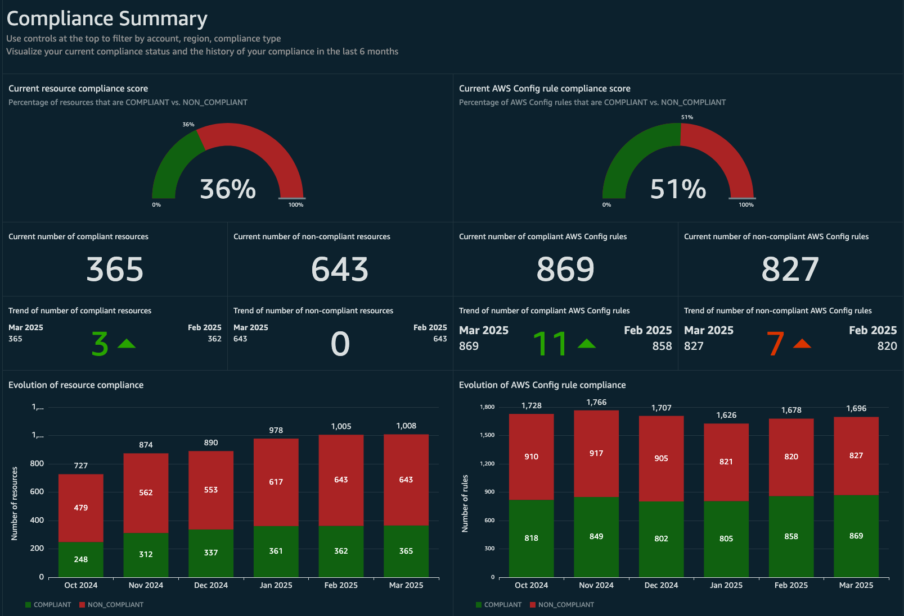
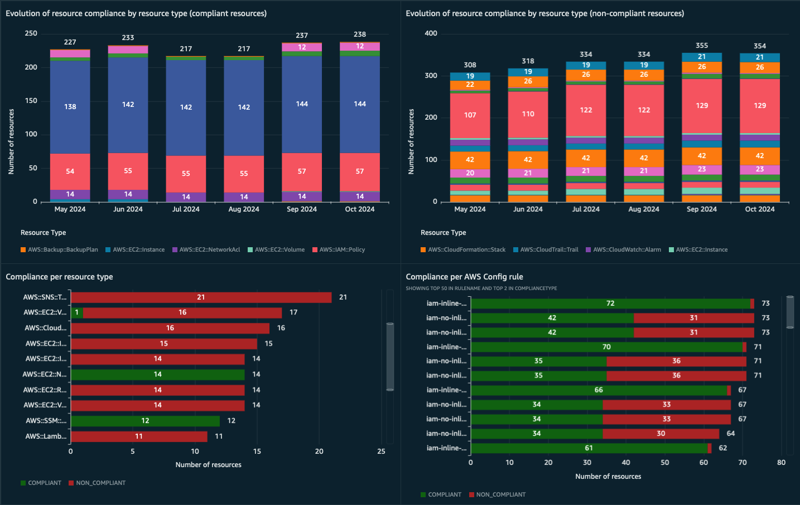
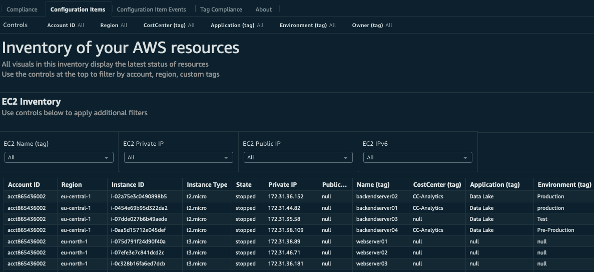
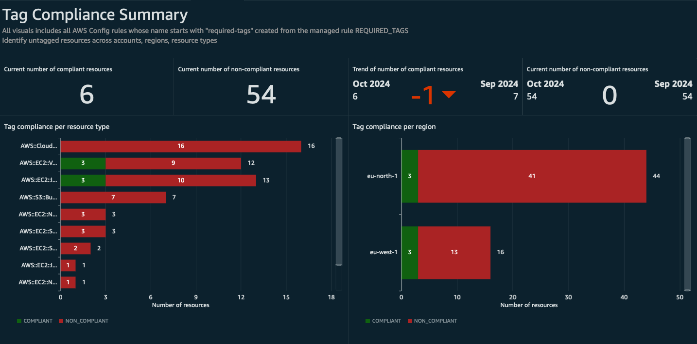
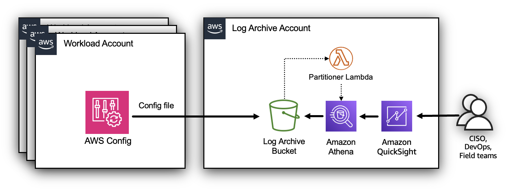
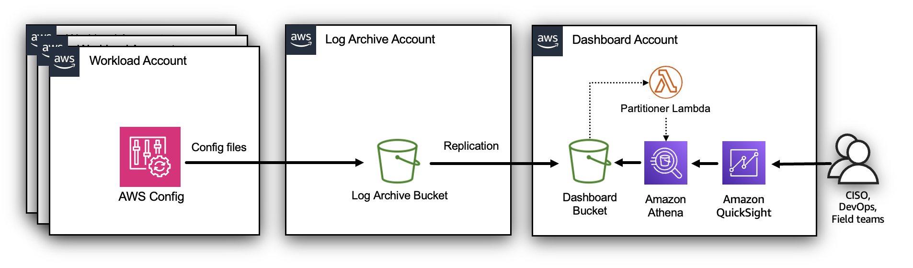
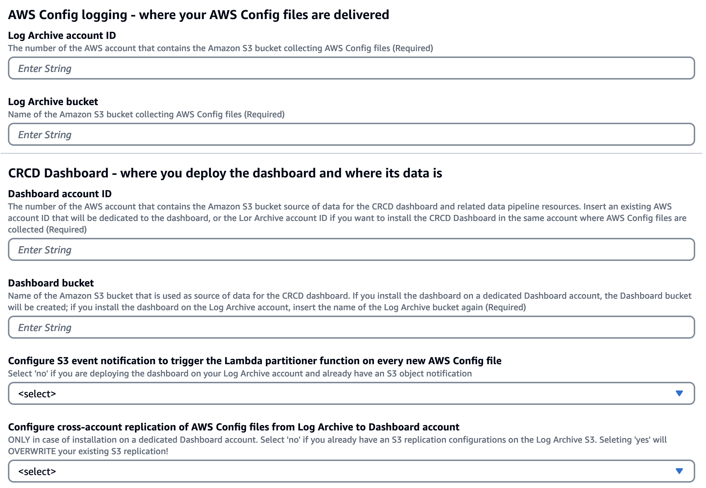
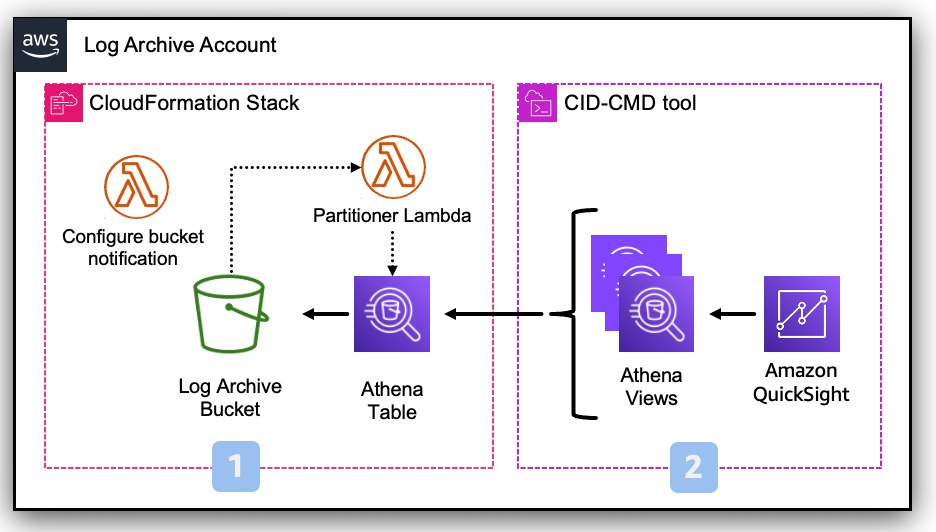
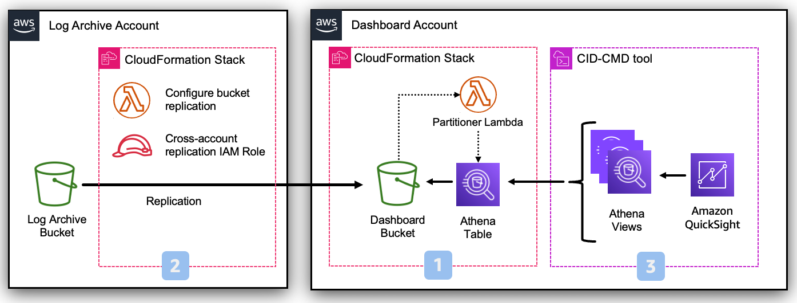

# Cloud Intelligence Dashboards - AWS Config Resource Compliance Dashboard (CRCD) v2.1.0

## Description





The AWS Config Resource Compliance Dashboard (CRCD) collects your AWS Config data to show the inventory of your AWS resources, along with their compliance status, running across multiple AWS accounts and regions.

### Advantages
The AWS Config Resource Compliance Dashboard (CRCD) delivers:

#### A simplified Configuration Management Database (CMDB) experience in AWS
Avoid investment in a dedicated external CMDB system or third-party tools and access the inventory of resources in a single pane of glass, without accessing the AWS Management Console on each aacount and region. Filter resources by account, region, custom tags and IP address. Plan the upgrade of Amazon RDS DB engines and AWS Lambda runtimes.

#### Compliance
Track compliance of your AWS Config rules and conformance packs per service, region, account, resource. Identify non compliant resources and establish a process of continuous compliance review. Verify that your tagging strategy is consistently applied.

#### Security
The CRCD dashboard is a tool for security teams to establish a compliance practice and offers visibility over security compliance to field teams, without having them access AWS Config service or dedicated security tooling accounts.


### Dashboard features

The AWS Config Resource Compliance Dashboard (CRCD) delivers the following.

#### AWS Config compliance
- At a glance status of how many resources and AWS Config rules are compliant or non-compliant
- Month-by-month evolution of the compliance status of your resources and AWS Config rules
- Breakdown of compliance per service, account and region
- Compliance tracking of AWS Config rules and conformance packs

#### Custom tags support
Inventory of Amazon EC2, Amazon EBS, Amazon S3, Amazon Relational Database Service (RDS) and AWS Lambda resources with filtering on account, region, customizable tags.



The dashboard allows filtering of resources by the custom tags that you use to categorize workloads. The name of the tags will be provided by you during installation.


#### Inventory Dashboard
The AWS Config [inventory dashboard](https://docs.aws.amazon.com/config/latest/developerguide/viewing-the-aggregate-dashboard.html#aggregate-compliance-dashboard) is replicated here, so that you can share it without granting access to the AWS Config console.

#### Tag compliance
Tag compliance collects the results of AWS Config Managed Rule [required-tags](https://docs.aws.amazon.com/config/latest/developerguide/required-tags.html). You can activate this rule as many times as needed, just give it a name that starts with `required-tags`.




## Architecture
The solution can be deployed in standalone AWS accounts and AWS accounts that are member of an AWS Organization. In both cases, AWS Config is configured to deliver configuration files to a centralized S3 bucket on a dedicated Log Archive account. 

There are two possible ways to deploy the CRCD dashboard on AWS Organizations. You can utilize the same Log Archive account where your AWS Config configuration files are delivered; in this case the architecture would look like this.




Alternatively, you can create a separate Dashboard account to deploy the dashboard resources. In this case, objects from the Log Archive bucket in the Log Archive account are replicated to another bucket in the Dashboard account.




You can also deploy the dashboard on a standalone account that has AWS Config enabled. This may be useful for proof of concept or to test out the CRCD Dashboard. In this case, all resources are deployed on the same AWS account.

An Amazon Athena table is used to extract data from AWS Config files delivered to Amazon S3. Whenever there's a new object in the bucket, the Lambda Partitioner function is triggered. This function checks if the object is an AWS Config configuration snapshot or configuration history file, and adds a new partition to the corresponding Athena table with the new data. If the object is neither a configuration snapshot nor configuration history file, the function ignores it. 

The solution provides Athena views, which are SQL queries that extract data from Amazon S3 using the schema defined in the previously mentioned table. Finally, you can visualize the data in a QuickSight dashboard that use these views through Amazon QuickSight datasets.

For more information on how the Lambda Partitioner function recognizes AWS Config files, see [Amazon S3 prefixes for AWS Config objects](README.md#amazon-s3-prefixes-for-aws-config-objects).


## Before you start
### Regional considerations
**Data transfer costs will incur when Amazon Athena queries an Amazon S3 bucket across regions.**

To avoid cross-region data transfer, Amazon Quicksight and the Amazon S3 bucket that contains AWS Config files must be deployed in the same region. 

If you have already deployed either one of the resources, the other must use the same region. If you haven't deployed anything yet, you can chose a region of your preference. If you have deployed both resources in different regions, we strongly recommend making changes so that both are in the same region.

Once you have decided the region, AWS resources supporting the dashboard (deployed via CloudFormation) must be deployed in the same region.


### AWS Config considerations
_You can skip this paragraph if you have AWS Config enabled._

The solution leverages AWS Config data to build the visualizations on the dashboard. If you **do not** have AWS Config enabled, we strongly recommend that you build your strategy first, i.e. decide which accounts, regions and resources to monitor, what does "compliance" mean to your organization, which account is going to be delegated admin for AWS Config, and so on. Only when the AWS Config setup matches your needs, you should consider deploying this dashboard.

### Control Tower and drift

_TODO explain_

### Deployment architecure 
The most important decision is to whether you want to install the dashboard on a dedicated Dashboard account or directly into the Log Archive account. These are the implications of each architecture.

#### Log Archive account architecture
| Pros  | Cons   | 
|---|---|
| Keep your logs secure in the Log Archive account  | Your security team must install and maintain the CRCD Dashboard resources, including users access to Quicksight  |
| Avoid additional cost for data transfer and storing your data on the Dashboard account  | The CRCD Dashboard adds complexity in users management to possible Quicksight dashbaords that you already have deployed on the Log Archive account   |
|   | Some steps of the configurations must be done manually (_TODO TBC_) to avoid causing drift in case you use Control tower  |


#### Dashboard account architecture
| Pros  | Cons   | 
|---|---|
| Allow your DevOps or external teams independence in installing and maintaining the dashboard, as well as regulating user access  | Your security data will be copied to another AWS account  |
| Limited number of resources deployed on Log Archive account| This installation may (_TODO TBC_) cause drift in case you use Control Tower |
| | Some Control Tower installations may collect AWS Config and AWS CloudTrail on the same bucket. This means that all your security logs will be replicated to another account |
||You will incur additional costs for the replication and storing a copy of your data on another Amazon S3 bucket|


## Prerequisites
 
1. AWS Config enabled in the accounts and regions you want to track, setup the delivery of AWS Config files to a centralized S3 bucket (the Log Archive bucket) in the Log Archive account
1. An AWS Account where you'll deploy the dashboard (the Dashboard account)
1. IAM Role or IAM User with permissions to deploy the infrastructure using CloudFormation
1. Sign up for [Amazon QuickSight](https://docs.aws.amazon.com/quicksight/latest/user/signing-up.html) and create a user:
    1. Select **Enterprise** edition
    2. Paginated Reports are not required for the CRCD dashboard. On the **Get Paginated Report add-on** choose the option you prefer
    3. **Use IAM federated identities and QuickSight-managed users**
    4. Select the region where to deploy the dashboard. We recommend using the same region of your Amazon S3 bucket
    5. Add an username and an e-mail where you'll receive notifications about failed QuickSight datasets updates
    6. Use the **QuickSight-managed role (default)**
    7. Don't modify the **Allow access and autodiscovery for these resources** section and click on **Finish**
1. Ensure you have SPICE capacity left in the region where you're deploying the dashboard


## Deployment Instructions 

_TODO describe and represent well separation between **data pipeline** and **dashboard** installation_

The infrastructure needed to collect and process the data is defined in CloudFormation. The dashboard resources are defined in a template file that can be installed using the CID-CMD tool.

Regardless of the deployment of the deployment architecture of your choice, you will use the same YAML file for the CloudFormation template; specific input parameters to the template will determine what will be installed.



**Parameter group: AWS Config logging - where your AWS Config files are delivered**

These parameters specify information about your AWS Config setup. They never change depending on the architecture of your deployment.
* Log Archive account ID
  * This is always the number of the AWS account that contains the Amazon S3 bucket collecting AWS Config files
* Log Archive bucket
  * This is always the name of the Amazon S3 bucket collecting AWS Config files


**Parameter group: CRCD Dashboard - where you deploy the dashboard and where its data is**

These parameters define where you install your dashboard. It is your choice to specify the same values as above (for deployment on the Log Archive account), or a different AWS account ID and bucket name (if you chose to deploy on a dedicated dashboard account).
* Dashboard account ID
  * The number of the AWS account that contains the Amazon S3 bucket source of data for the CRCD dashboard and related data pipeline resources
* Dashboard bucket
  * Name of the Amazon S3 bucket that is used as source of data for the CRCD dashboard
* Configure S3 event notification to trigger the Lambda partitioner function on every new AWS Config file
  * More details below
* Configure cross-account replication of AWS Config files from Log Archive to Dashboard account
  * More details below


Follow instructions on one of the paragraphs below, depending on the architecture of choice.

### Installation on Log Archive account
The installation process consists of two steps:
1. Data pipeline resources for the dashboard, via CloudFormation stack
1. Quicksight resources for the dashboard and the necessary Athena views, using the CID-CMD command line tool



#### Deployment Steps
**At every step, make sure you are in the region where both your Log Archive bucket and Amazon QuickSight are deployed.**

##### Step 1
Log into the AWS Management Console for your **Log Archive account**.

1. Open the CloudFormation console and upload the template file `cloudformation/cid-crcd-resources.yaml`. Specify these parameters:
   - `Stack name` This is up to you, but we recommend to call it `cid-crcd-resources`
   - `User name of QuickSight user` User name of QuickSight user (as displayed in QuickSight admin panel), see [here](https://quicksight.aws.amazon.com/sn/admin#users)
   - `Log Archive account ID` The number of the AWS account where you are currently logged in
   - `Log Archive bucket` Name of the Amazon S3 bucket that collects AWS Config data
   - `Dashboard account ID` Insert again the number of the AWS account where you are currently logged in. It is important to repeat the same value as `Log Archive account ID` for the CloudFormation template to deploy the resources for this deployment
   - `Dashboard bucket` Insert again the name of the Amazon S3 bucket that collects AWS Config data. It is important to repeat the same value as `Log Archive bucket` for the CloudFormation template to deploy the resources for this deployment
   - `Configure S3 event notification` Whenever a new AWS Config file is delivered to the Log Archive bucket, a lambda function must be called to create the corresponding partition on Amazon Athena. This leverages S3 event notifications which is configured by this template if you select `yes` here. There may be cases in which AWS customers already have configured event notifications on the Log Archive bucket; in this case select `no` and then you'll have to manually configure this part (more details below)
   - `Configure cross-account replication` Leave it at the default value. This parameter is ignored in this deployment mode
   - **Leave every other parameter to its default value**
1. Run the template.
1. Note down the following from the output of the CloudFormation template: _TODO check again_
   - `LambdaARN`
   - `LambdaRoleARN`
   - `QuickSightDataSourceRole`

##### Step 2
Stay logged into the AWS Management Console for your **Log Archive account**.


1. Deploy QuickSight Dashboard using the [CID-CMD](https://github.com/aws-samples/aws-cudos-framework-deployment) tool:
   - Navigate to the AWS Management Console and open AWS CloudShell. Be sure to be in the correct region
   - The tool requires Python 3
   - Make sure you have the latest pip package installed:
    ```
    python3 -m ensurepip --upgrade
    ```
   - Install the CID-CMD tool running the following command:
    ```
    pip3 install --upgrade cid-cmd
    ```
   - On the top right corner, click on `Actions`, and then `Upload file`
   - Select the `cid-crcd.yaml` file under the `dashboard_template` directory and click on `Upload`
   - Deploy the dashboard running the command (replace first the following parameters):
     - `--quicksight-datasource-role` The value of the output `QuickSightDataSourceRole` from the CloudFormation template
     - `--tag1` The name of the first tag you use to categorize workloads
     - `--tag2` The name of the second tag you use to categorize workloads
     - `--tag3` The name of the third tag you use to categorize workloads
     - `--tag4` The name of the fourth tag you use to categorize workloads
     - Notice that tag parameters are case sensitive and cannot be empty. If you do not use a tag, pass a short default value, e.g. `--tag4 'tag4'`
     - **Leave every other parameter to its default value**

    ```
    cid-cmd deploy --resources 'cid-crcd.yaml' --quicksight-datasource-role 'REPLACE-WITH-CLOUDFORMATION-OUTPUT' --tag1 'REPLACE_WITH_CUSTOM_TAG_1' --tag2 'REPLACE_WITH_CUSTOM_TAG_2' --tag3 'REPLACE_WITH_CUSTOM_TAG_3' --tag4 'REPLACE_WITH_CUSTOM_TAG_4' --dashboard-id 'cid-crcd' --athena-database 'cid_crcd_database'  --athena-workgroup 'cid-crcd-dashboard'
    ```
1. During installation the CID-CMD tool will ask you `[quicksight-datasource-id] Please choose DataSource (Select the first one if not sure): (Use arrow keys)` If you have installed other CID/CUDOS dashboards, you already have a datasource called `CID-CMD-Athena`. Select it, otherwise select `CID-CMD-Athena <CREATE NEW DATASOURCE>`
1. When asked `[timezone] Please select timezone for datasets scheduled refresh.: (Use arrow keys)` select the time zone for dataset scheduled refresh in your region (it is already preselected)
1. When asked `[share-with-account] Share this dashboard with everyone in the account?: (Use arrow keys)` select the option that works for you
1. Enable Refresh Schedule on Datasets. This will refresh the data in QuickSight with the frequency you specify:
   - Navigate to QuickSight and then Datasets
   - The datasets for this dashboard have all the `config_` prefix
   - Click on a Dataset, and then open the Refresh tab
   - Click on Add a new schedule, select Full refresh and a Frequency


#### Manual setup of S3 event notification
_TODO_

### Installation on dedicated Dashboard account

The installation process consists of three steps:
1. On the Dashboard account: data pipeline resources for the dashboard, via CloudFormation stack
1. On the Log Archive account: configure the S3 replication rule that will copy AWS Config files from the  Log Archive bucket to the Dashboard bucket, via CloudFormation stack
1. On the Dashboard account: Quicksight resources for the dashboard and the necessary Athena views, using the CID-CMD command line tool



#### Deployment Steps

**At every step, make sure you are in the region where both your Log Archive bucket and Amazon QuickSight are deployed.**

##### Step 1
Log into the AWS Management Console for your **Dashboard account**.

1. Open the CloudFormation console and upload the template file `cloudformation/cid-crcd-resources.yaml`. Specify these parameters:
   - `Stack name` This is up to you, but we recommend to call it `cid-crcd-resources`
   - `User name of QuickSight user` User name of QuickSight user (as displayed in QuickSight admin panel), see [here](https://quicksight.aws.amazon.com/sn/admin#users)
   - `Log Archive account ID` The number of the Log Archive account. Notice this in NOT where you are currently logged in
   - `Log Archive bucket` Name of the Amazon S3 bucket that collects AWS Config data
   - `Dashboard account ID` Insert the number of the AWS account where you are currently logged in. It is important that this is different than the value in `Log Archive account ID` for the CloudFormation template to deploy the resources for this deployment
   - `Dashboard bucket` Insert the name of the Amazon S3 bucket that will collect AWS Config data. This bucket will be created by the CloudFormation template. It is important that this is different than the value in `Log Archive bucket` for the CloudFormation template to deploy the resources for this deployment
   - `Configure S3 event notification` Leave it at the default value. This parameter is ignored in this deployment mode
   - `Configure cross-account replication` Leave it at the default value. This parameter is ignored in this deployment mode
   - **Leave every other parameter to its default value**
1. Run the template.
1. Note down the following from the output of the CloudFormation template: _TODO check again_
   - `LambdaARN`
   - `LambdaRoleARN`
   - `QuickSightDataSourceRole`

##### Step 2
Log into the AWS Management Console for your **Log Archive account**.

1. Open the CloudFormation console and upload the template file `cloudformation/cid-crcd-resources.yaml`. Specify these parameters:
   - `Stack name` This is up to you, but we recommend to call it `cid-crcd-resources`
   - `User name of QuickSight user` Leave it at the default value. This parameter is ignored in this deployment mode
   - `Log Archive account ID` The number of the AWS account where you are currently logged in
   - `Log Archive bucket` Name of the Amazon S3 bucket that collects AWS Config data
   - `Dashboard account ID` Insert the number of the Dashboard account used at Step 1. Notice this in NOT where you are currently logged in. It is important that this is different than the value in `Log Archive account ID` for the CloudFormation template to deploy the resources for this deployment
   - `Dashboard bucket` Insert the name of the Amazon S3 bucket that will collect AWS Config data. Insert the bucket name that you specified in this field at Step 1. It is important that this is different than the value in `Log Archive bucket` for the CloudFormation template to deploy the resources for this deployment
   - `Configure S3 event notification` Leave it at the default value. This parameter is ignored in this deployment mode
   - `Configure cross-account replication` Select `yes` to let the template configure S3 replication from the Log Archive bucket to the Dashboard bucket. There may be cases in which AWS customers already have configured S3 replication on the Log Archive bucket; in this case select `no` and then you'll have to manually configure this part (more details below)
     - Please notice that if you select `yes`, any existing S3 replication configuration will be overwritten!
   - **Leave every other parameter to its default value**
1. Run the template.

##### Step 3
Log back into the AWS Management Console for your **Log Archive account**.


1. Deploy QuickSight Dashboard using the [CID-CMD](https://github.com/aws-samples/aws-cudos-framework-deployment) tool:
   - Navigate to the AWS Management Console and open AWS CloudShell. Be sure to be in the correct region
   - The tool requires Python 3
   - Make sure you have the latest pip package installed:
    ```
    python3 -m ensurepip --upgrade
    ```
   - Install the CID-CMD tool running the following command:
    ```
    pip3 install --upgrade cid-cmd
    ```
   - On the top right corner, click on `Actions`, and then `Upload file`
   - Select the `cid-crcd.yaml` file under the `dashboard_template` directory and click on `Upload`
   - Deploy the dashboard running the command (replace first the following parameters):
     - `--quicksight-datasource-role` The value of the output `QuickSightDataSourceRole` from the CloudFormation template
     - `--tag1` The name of the first tag you use to categorize workloads
     - `--tag2` The name of the second tag you use to categorize workloads
     - `--tag3` The name of the third tag you use to categorize workloads
     - `--tag4` The name of the fourth tag you use to categorize workloads
     - Notice that tag parameters are case sensitive and cannot be empty. If you do not use a tag, pass a short default value, e.g. `--tag4 'tag4'`
     - **Leave every other parameter to its default value**

    ```
    cid-cmd deploy --resources 'cid-crcd.yaml' --quicksight-datasource-role 'REPLACE-WITH-CLOUDFORMATION-OUTPUT' --tag1 'REPLACE_WITH_CUSTOM_TAG_1' --tag2 'REPLACE_WITH_CUSTOM_TAG_2' --tag3 'REPLACE_WITH_CUSTOM_TAG_3' --tag4 'REPLACE_WITH_CUSTOM_TAG_4' --dashboard-id 'cid-crcd' --athena-database 'cid_crcd_database'  --athena-workgroup 'cid-crcd-dashboard'
    ```
1. During installation the CID-CMD tool will ask you `[quicksight-datasource-id] Please choose DataSource (Select the first one if not sure): (Use arrow keys)` If you have installed other CID/CUDOS dashboards, you already have a datasource called `CID-CMD-Athena`. Select it, otherwise select `CID-CMD-Athena <CREATE NEW DATASOURCE>`
1. When asked `[timezone] Please select timezone for datasets scheduled refresh.: (Use arrow keys)` select the time zone for dataset scheduled refresh in your region (it is already preselected)
1. When asked `[share-with-account] Share this dashboard with everyone in the account?: (Use arrow keys)` select the option that works for you
1. Enable Refresh Schedule on Datasets. This will refresh the data in QuickSight with the frequency you specify:
   - Navigate to QuickSight and then Datasets
   - The datasets for this dashboard have all the `config_` prefix
   - Click on a Dataset, and then open the Refresh tab
   - Click on Add a new schedule, select Full refresh and a Frequency

### Installation on dedicated Dashboard account [OLD]

Follow this optional step if you want to install the AWS Config Resource Compliance Dashboard (CRCD) on a Dashboard Account separated from the Log Archive account. In this case, the architecture of the solution is below.


**Skip to the next paragraph to install the dashboard directly on the Log Archive account.**

For this scenario it is necessary to configure object replication from the centralized Amazon S3 Config bucket in the Log Archive account (the source bucket), to an Amazon S3 bucket that you will create in the Dashboard Account (the destination bucket).

Log onto the Dashboard Account, open the Amazon S3 console and create an Amazon S3 bucket in the region where you will deploy the dashboard, make sure to activate versioning. From now on, this will be called the **Data Collection Bucket**. 

Now log onto the Log Archive Account and open the Amazon S3 console. You can replicate AWS Config files from the centralized Amazon S3 Config bucket to the Data Collection Bucket through an Amazon S3 Replication configuration, follow the instructions [here](https://docs.aws.amazon.com/AmazonS3/latest/userguide/replication-walkthrough-2.html). Once you create the replication configuration on the source bucket, write down the ARN of the IAM role created for the replication. Amazon S3 assumes this IAM role to replicate objects across accounts on your behalf.

After you created the Replication Configuration, you need to modify the Bucket Policy of the Data Collection Bucket in the destination account to allow the source account to replicate S3 objects. 

Replace `SOURCE_ACCOUNT_REPLICATION_ROLE_ARN` and `DESTINATION_BUCKET_ARN` in the policy below with the corresponding values, and add the policy to the Data Collection Bucket using the AWS Console.

```
{
    "Version":"2012-10-17",
    "Id":"",
    "Statement":[
      {
         "Sid": "HTTPSOnly",
         "Effect": "Deny",
         "Principal": "*",
         "Action": "s3:*",
         "Resource": [
             "DESTINATION_BUCKET_ARN/*",
             "DESTINATION_BUCKET_ARN"
         ],
         "Condition": {
             "Bool": {
                 "aws:SecureTransport": "false"
             }
         }
      },
      {
         "Sid":"Set permissions for objects",
         "Effect":"Allow",
         "Principal":{
            "AWS":"SOURCE_ACCOUNT_REPLICATION_ROLE_ARN"
         },
         "Action":["s3:ReplicateObject", "s3:ReplicateDelete"],
         "Resource":"DESTINATION_BUCKET_ARN/*"
      },
      {
         "Sid":"Set permissions on bucket",
         "Effect":"Allow",
         "Principal":{
            "AWS":"SOURCE_ACCOUNT_REPLICATION_ROLE_ARN"
         },
         "Action":["s3:List*", "s3:GetBucketVersioning", "s3:PutBucketVersioning"],
         "Resource":"DESTINATION_BUCKET_ARN"
      }
    ]
 }
```

You can follow [these instructions](https://docs.aws.amazon.com/AmazonS3/latest/userguide/add-bucket-policy.html) for that.

Once object replication is configured, follow the instructions on the next paragraph. In your case, the Amazon S3 bucket will always be the Data Collection Bucket.

## Deployment Steps [OLD]

1. At every step, make sure you are in the region where both your central Config Amazon S3 bucket Amazon QuickSight are deployed.
1. Open the CloudFormation console and upload the template file `cloudformation/cid-crcd-resources.yaml`. Specify these parameters:
   - `Stack name` This is up to you, but we recommend to call it `cid-crcd-resources`
   - `QuickSightUser` User name of QuickSight user (as displayed in QuickSight admin panel), see [here](https://quicksight.aws.amazon.com/sn/admin#users)
   - `ConfigLoggingBucket` Name of the Amazon S3 bucket that collects AWS Config data
   - **Leave every other parameter to its default value**
1. Run the template.
1. Write down the following from the output of the CloudFormation template:
   - `LambdaARN`
   - `LambdaRoleARN`
   - `QuickSightDataSourceRole`
1. Deploy QuickSight Dashboard using the [CID-CMD](https://github.com/aws-samples/aws-cudos-framework-deployment) tool:
   - Navigate to the AWS Console and open AWS CloudShell. Be sure to be in the correct region
   - The tool requires Python 3
   - Make sure you have the latest pip package installed:
    ```
    python3 -m ensurepip --upgrade
    ```
   - Install the CID-CMD tool running the following command:
    ```
    pip3 install --upgrade cid-cmd
    ```
   - On the top right corner, click on `Actions`, and then `Upload file`
   - Select the `CID-Config.yaml` file under the `dashboard_template` directory and click on `Upload`
   - Deploy the dashboard running the command (replace first the following parameters):
     - `--quicksight-datasource-role` The value of the output `QuickSightDataSourceRole` from the CloudFormation template
     - `--tag1` The name of the first tag you use to categorize workloads
     - `--tag2` The name of the second tag you use to categorize workloads
     - `--tag3` The name of the third tag you use to categorize workloads
     - `--tag4` The name of the fourth tag you use to categorize workloads
     - Notice that tag parameters are case sensitive and cannot be empty. If you do not use a tag, pass a short default value, e.g. `--tag4 'tag4'`
     - **Leave every other parameter to its default value**

    ```
    cid-cmd deploy --resources 'cid-crcd.yaml' --quicksight-datasource-role 'REPLACE-WITH-CLOUDFORMATION-OUTPUT' --tag1 'REPLACE_WITH_CUSTOM_TAG_1' --tag2 'REPLACE_WITH_CUSTOM_TAG_2' --tag3 'REPLACE_WITH_CUSTOM_TAG_3' --tag4 'REPLACE_WITH_CUSTOM_TAG_4' --dashboard-id 'cid-crcd' --athena-database 'cid_crcd_database'  --athena-workgroup 'cid-crcd-dashboard'
    ```
1. During installation the CID-CMD tool will ask you `[quicksight-datasource-id] Please choose DataSource (Select the first one if not sure): (Use arrow keys)` If you have installed other CID/CUDOS dashboards, you already have a datasource called `CID-CMD-Athena`. Select it, otherwise select `CID-CMD-Athena <CREATE NEW DATASOURCE>`
1. When asked `[timezone] Please select timezone for datasets scheduled refresh.: (Use arrow keys)` select the time zone for dataset scheduled refresh in your region (it is already preselected)
1. When asked `[share-with-account] Share this dashboard with everyone in the account?: (Use arrow keys)` select the option that works for you
1. Enable Refresh Schedule on Datasets. This will refresh the data in QuickSight with the frequency you specify:
   - Navigate to QuickSight and then Datasets
   - The datasets for this dashboard have all the `config_` prefix
   - Click on a Dataset, and then open the Refresh tab
   - Click on Add a new schedule, select Full refresh and a Frequency

1. Configure the Config S3 bucket to trigger the Lambda Partitioner function when objects are added to the bucket and allow the same function permission to read objects:
   - Enable a Lambda event notification [follow these instructions](https://docs.aws.amazon.com/AmazonS3/latest/userguide/enable-event-notifications.html#enable-event-notifications-sns-sqs-lam) so that the Lambda Partitioner function will be called every time a new Config Snapshot is available. Use the following parameters:
     - Name = `cid-crcd-deliver-config-snapshot`
     - Event types = `All object create events`
     - Destination = `Lambda function`
     - Click on `Choose from your Lambda functions` and select the lambda function `cid-crcd-config-snapshot-partitioner` from the drop down list
     - Alternatively, select `Enter Lambda function ARN` and enter the value of the output `LambdaARN` returned by the CloudFormation script on the `Lambda function` field
   - Add the following statement to the bucket policy [follow these instructions](https://docs.aws.amazon.com/AmazonS3/latest/userguide/add-bucket-policy.html):
     - Replace `LAMBDA-PARTITIONER-RULE-ARN` with the output `LambdaRoleARN` returned by the CloudFormation script
     - Replace `YOUR-CONFIG-BUCKET` with the name of the Config S3 bucket

    ```
        {
            "Sid": "Lambda Partitioner access for CRCD dashboard",
            "Effect": "Allow",
            "Principal": {
                "AWS": "LAMBDA-PARTITIONER-ROLE-ARN"
            },
            "Action": [
				"s3:GetBucketLocation",
				"s3:GetObject",
				"s3:ListBucket",
				"s3:GetObjectVersion"
			],
            "Resource": [
                "arn:aws:s3:::YOUR-CONFIG-BUCKET",
                "arn:aws:s3:::YOUR-CONFIG-BUCKET/*"
            ]
        }
    ```

> The code in the Lambda Partitioner function supports this advanced scenario.
> * If your bucket publishes events notifications to an SNS topic, you can subscribe the Lambda Partitioner function to the topic.
> * If your bucket already sends event notifications to a lambda function, you can change that notification to an SNS topic and subscribe your function and the Lambda Partitioner function to that SNS topic.


1. Visualize the dashboard:
   - Navigate to QuickSight and then Dashboards
   - Make sure you are in the correct region
   - Click on the **AWS Config Resource Compliance Dashboard (CRCD)** dashboard


## Destroy resources

In order to destroy the dashboard, you need to:

1. Navigate to the AWS Console and open AWS CloudShell in the region where you have deployed the dashboard
1. Delete the dashboard by executing the following command:

```
cid-cmd delete --resources cid-crcd.yaml
```

Where:

* `cid-crcd.yaml` is the template file provided in `dashboard_template` directory (upload it to CloudShell if needed)

3. When prompted:
   - Select the `[cid-crcd] AWS Config Resource Compliance Dashboard (CRCD)` dashboard
   - For each QuickSight dataset, choose `yes` to delete the dataset
   - Accept the default values of the S3 Path for the Athena table
   - Accept the default values of the four tags
   - For each Athena view, choose `yes` to delete the dataset

1. On the same account, open CloudFormation and delete the template that installed the resources for the dashboard (make sure to empty the Amazon S3 bucket hosting the Athena Query results first)
1. Revert any manual change done during setup:
   - Amazon S3 Config Logging Bucket: remove the bucket policy statement that allows the Lambda Partitioner function to read objects
   - Amazon S3 Config Logging Bucket: remove the Event notification that triggered the  Lambda Partitioner function
   - If you configured replication for the Config objects across accounts, remove the destination bucket and the replication configuration

# Additional Information

## Amazon S3 prefixes for AWS Config files

The dashboard uses these sources to get the inventory of resources and their compliance with AWS Config Rules and Conformance Packs: AWS Config configuration history and configuration snapshot files. Check this [blog post](https://aws.amazon.com/blogs/mt/configuration-history-configuration-snapshot-files-aws-config/) for more on the difference between AWS Config configuration history and configuration snapshot files.


The solution supports the following ways of activating AWS Config:
1. manual setup on standalone AWS accounts
1. deployment by AWS Control Tower on AWS Organizations
1. AWS Config configuration history and configuration snapshot files

These two options have different ways of structuring the prefixes of the AWS Config files on Amazon S3. They are defined below, and the Lambda Partitioner function supports all of them.

**Verify that your setup is compatible with the Amazon S3 prefixes.** If not, the Lambda Partitioner function will not be able to recognize objects as valid AWS Config files and will discard them. As a consequence, your Athena table will be empty.


### Supported AWS Config prefixes on Amazon S3

#### Manual AWS Config setup 
`AWSLogs/ACCOUNT-ID/Config/REGION/YYYY/MM/DD/ConfigSnapshot/ACCOUNT-ID_Config_REGION_ConfigSnapshot_TIMESTAMP_RANDOM.json.gz`

`AWSLogs/ACCOUNT-ID/Config/REGION/YYYY/MM/DD/ConfigHistory/ACCOUNT-ID_Config_REGION_ConfigHistory_RESOURCE-ID_TIMESTAMP_RANDOM.json.gz`

#### AWS Control Tower deployment
`AWS-ORGANIZATION-ID/AWSLogs/ACCOUNT-ID/Config/REGION/YYYY/MM/DD/ConfigSnapshot/ACCOUNT-ID_Config_REGION_ConfigSnapshot_TIMESTAMP_RANDOM.json.gz`

`AWS-ORGANIZATION-ID/AWSLogs/ACCOUNT-ID/Config/REGION/YYYY/MM/DD/ConfigHistory/ACCOUNT-ID_Config_REGION_ConfigHistory_RESOURCE-ID_TIMESTAMP.json.gz`

Where:
* `AWS-ORGANIZATION-ID` is the identifier of your AWS Organization
* `ACCOUNT-ID` is the 12-digit AWS Account number, e.g. 123412341234
* `REGION` identifies an AWS region, e.g. us-east-1
* `YYYY/MM/DD` represents a date, e.g. 2024/04/18
* `TIMESTAMP` is a full timestamp, e.g. 20240418T054711Z
* `RESOURCE-ID` identifies the resource affected by the ConfigHistory record, e.g. AWS::Lambda::Function
* `RANDOM` is a sequence of random character, e.g. a970aeff-cb3d-4c4e-806b-88fa14702hdb


# Security

See [CONTRIBUTING](CONTRIBUTING.md#security-issue-notifications) for more information.

# License

This library is licensed under the MIT-0 License. See the LICENSE file.