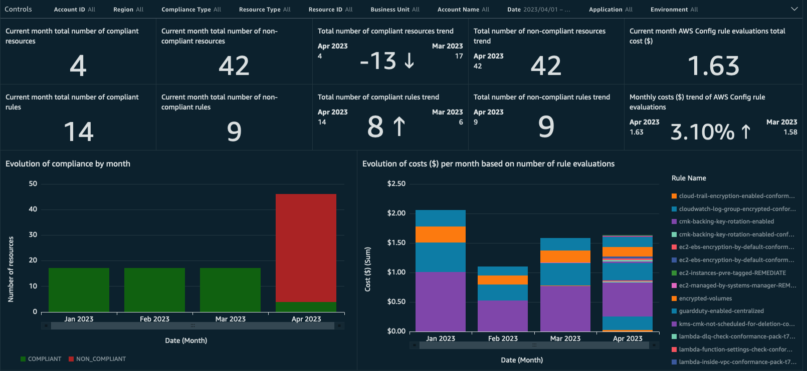
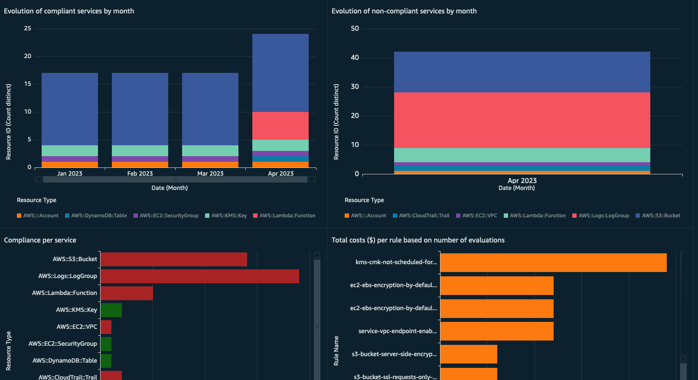
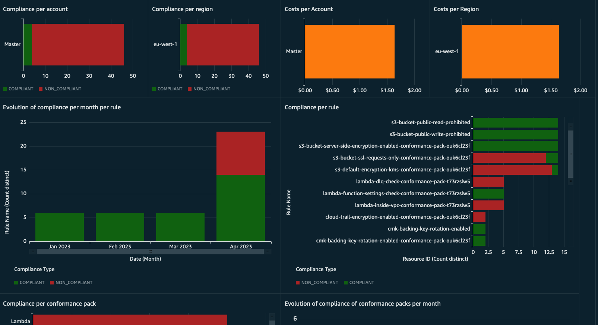

# Cloud Intelligence Dashboards - Config Resource Compliance Dashboard (CRCD)





## Description:

The Config Resource Compliance Dashboard (CRCD) shows the inventory of resources, along with their compliance status, running across multiple AWS accounts. The dashboard provides:

- Month-by-month evolution of the compliance status of your resources
- Month-by-month evolution of the estimated incurred costs due to AWS Config Rules evaluations
- Breakdown of compliance per service, account and region
- Breakdown of estimated incurred costs per evaluated AWS Config Rule
- Compliance of AWS Config Rules and Conformance Packs

The dashboard uses two sources to get these insights:

- AWS Config Configuration Snapshots: to get the inventory of resources and their compliance with AWS Config Rules and Conformance Packs using Configuration Snapshots
- AWS CloudTrail Events: to calculate estimated incurred costs due to AWS Config Rules evaluations based on the number of CloudTrail events. **We estimate incurred costs by computing $0.001 per rule evaluation per region as per the current [AWS Config pricing](https://aws.amazon.com/config/pricing/). Your total number of evaluations may put you in a different pricing tier.** 

The infrastructure needed to collect and process the data is defined in Terraform. 

## Architecture

The solution needs Configuration Snapshots and CloudTrail events to be delivered to a S3 bucket. Whenever there's a new object in the bucket, a Lambda function is triggered. This function checks if the object is a Configuration Snapshot or a CloudTrail event, and adds a new partition to the corresponding Athena table with the new data. If object is neither, the function ignores it. 

In Athena, there are two tables: one to extract data from Configuration Snapshots and another to extract data from CloudTrail events. The solution provides Athena views, which are SQL queries that extract data from S3 using the schema defined in the previously mentioned tables. Finally, you can visualize the data in a QuickSight dashboard that use these Athena views through QuickSight datasets.


## Prerequisites
 
1. AWS Account where you'll deploy the dashboard
    1. This account shouldn't have Lake Formation enabled. Otherwise, you'll need to give extra permissions to the S3 buckets Terraform will create
2. IAM Role or IAM User with permissions to deploy the infrastructure using Terraform
3. If you haven't, sign up for [Amazon QuickSight](https://docs.aws.amazon.com/quicksight/latest/user/signing-up.html) and create an user
    1. Select **Enterprise** edition
    2. Paginated Reports are not required for the CRCD dashboard. On the **Get Paginated Report add-on** choose the option you prefer
    3. **Use IAM federated identities and QuickSight-managed users**
    4. Select the region where you plan to deploy the dashboard
    5. Add an username and an e-mail where you'll receive notifications on failed QuickSight datasets updates
    6. Use the **QuickSight-managed role (default)**
    7. Don't modify the **Allow access and autodiscovery for these resources** section and click on **Finish**
4. Terraform v1.3.7 or above. You can install the CLI following [these instructions](https://developer.hashicorp.com/terraform/tutorials/aws-get-started/install-cli)
5. Ensure you have SPICE capacity left in the region where you're deploying the dashboard
6. Enable AWS Config in the accounts and regions you want to track

## Deployment instructions

1. Navigate to the `terraform` directory of this repository
2. Modify `terraform.tfvars` with your variables as needed
3. Deploy the Terraform templates:
    1. Initialize: `terraform init`
    2. Validate: `terraform validate`
    3. Plan: `terraform plan -out terraform.tfplan`. Optionally, you can set up a S3 Bucket that will store the state file instead of storing it locally. Follow [this guide](https://www.terraform.io/language/settings/backends/s3) for that purpose
    4. Apply: `terraform apply "terraform.tfplan"`
4. Deploy QuickSight Dashboard using the [CID-CMD](https://github.com/aws-samples/aws-cudos-framework-deployment) tool:
    1. Navigate to the AWS Console and open AWS CloudShell
    2. Install the CID-CMD tool running the following command: 
    
    ```
        pip3 install git+https://github.com/aws-samples/aws-cudos-framework-deployment.git
    ```
    3. On the top right corner, click on `Actions`, and then `Upload file`
    4. Select the `CID-CRCD.yaml` file under the `dashboard_template` directory and click on `Upload`
    5. Deploy the dashboard running:

    ```
    cid-cmd deploy --resources CID-CRCD.yaml --quicksight-datasource-id CID-Athena --athena-database ATHENA_DATABASE --athena-workgroup ATHENA_WORKGROUP --quicksight-datasource-role-arn QUICKSIGHT_DATASOURCE_ROLE_ARN
    ```

    Where:

    * `resources` is the `CID-CRCD.yaml` template yaml file provided in `dashboard_template` directory
    * `quicksight-datasource-id` is `CID-Athena`
    * `quicksight-datasource-role-arn` is the role used by QuickSight data sources. Replace `QUICKSIGHT_DATASOURCE_ROLE_ARN` with `quicksight_datasource_role_arn` output obtained from Terraform
    * `athena-workgroup` is the Athena workgroup. Replace `ATHENA_WORKGROUP` with `athena_workgroup_name` output obtained from Terraform
    * `athena-database` is the Athena database. Replace `ATHENA_DATABASE` with `athena_database_name` output obtained from Terraform
5. When prompted:
    1. Select the `[cid-crcd] CID-Config` dashboard
    2. Accept the default values of the S3 Path for the two Athena tables. They should have the form of `s3://configdataAWSACCOUNTID/AWSLogs`, where `AWSACCOUNTID` is the 12 digit that represents your AWS Account ID
    3. Mark `yes` or `no` whether you want to share the dashboard with everyone in the account or not
6. Enable Refresh Schedule on Datasets. This will refresh the data in QuickSight with the frequency you specify:
    1. Navigate to QuickSight and then Datasets
    2. Click on a Dataset, and then open the `Refresh` tab
    3. Click on `Add a new schedule`, select `Full refresh` and a `Frequency`
7. Visualize the dashboard:
    1. Navigate to QuickSight and then Dashboards
    2. Click on the `CID-Config` dashboard

## Data ingestion

After deploying the Dashboard, you need to deliver AWS Config Configuration Snapshots and AWS CloudTrail Events to the Data Collection Bucket. For that, you can replicate them from the S3 bucket where you're currently collecting them, through a Replication Configuration. You can configure replication on the AWS Console following the instructions [here](https://docs.aws.amazon.com/AmazonS3/latest/userguide/replication-walkthrough-2.html). Alternatively, you can automate this process using the Terraform code provided in the **s3_replication/terraform** directory, that you can deploy in the source account. For that, you'll need to:

1. Ensure the source bucket has versioning enabled. You can enable versioning on the AWS Console following [these instructions](https://docs.aws.amazon.com/AmazonS3/latest/userguide/manage-versioning-examples.html) 
2. Assume an IAM role in the source account to deploy the infrastructure via Terraform
3. Navigate to the `s3_replication/terraform` directory
4. Modify `terraform.tfvars` and add the names of the source and destination buckets
5. Deploy the Terraform templates:
    1. Initialize: `terraform init`
    2. Validate: `terraform validate`
    3. Plan: `terraform plan -out terraform.tfplan`. Optionally, you can set up a S3 Bucket that will store the state file instead of storing it locally. Follow [this guide](https://www.terraform.io/language/settings/backends/s3) for that purpose
    4. Apply: `terraform apply "terraform.tfplan"`

After you created the Replication Configuration, you need to modify the Bucket Policy of the Data Collection Bucket in the destination account to allow the source account replicate the S3 objects. Replace **SOURCE_ACCOUNT_REPLICATION_ROLE_ARN** and **DESTINATION_BUCKET_ARN** in **s3_replication/destination_bucket_policy.json** with the values obtained from Terraform, and add the policy to the Data Collection Bucket using the AWS Console.You can follow [these instructions](https://docs.aws.amazon.com/AmazonS3/latest/userguide/add-bucket-policy.html) for that.

## Enabling Configuration Recorder

AWS Config uses the configuration recorder to detect changes in your resource configurations and capture these changes as configuration items which are sent to a S3 Bucket. For that, you'll need to enable the configuration recorder in all regions you want to track. 

You can automate this process using the code in the `config_setup` folder. This code will:

- Enable the Configuration Recorder to track resources in the regions you specify
- Create a S3 bucket where Configuration Snapshots will be delivered
- Create a Bucket Policy that allows AWS Config in the current account (where the infrastructure is deployed) to send Configuration Snapshots
- Enable Configuration Snapshots delivery with a daily frequency to the bucket

Run these instructions to enable Configuration Recorder in the regions you want to track:

1. Assume an IAM role in account to deploy the infrastructure via Terraform
2. Navigate to the `config_setup/terraform` directory
3. Modify `main.tf` and add **configuration_recorder** modules for all regions you want to track. You can reuse the ones provided. Repeat for all regions
4. Deploy the Terraform templates:
    1. Initialize the working directory: `terraform init`
    2. Validate the configuration without any remote interaction: `terraform validate`
    3. Create an execution plan and preview changes that Terraform will apply to the infrastructure: `terraform plan -out terraform.tfplan`. Optionally, you can set up a S3 Bucket that will store the state file instead of storing it locally. Follow [this guide](https://www.terraform.io/language/settings/backends/s3) for that purpose
    4. Apply the execution plan which will create the required resources: `terraform apply "terraform.tfplan"`

The bucket will allow Config snapshots only from the current account. However, you can modify the Bucket Policy and add the Account IDs of other accounts that should be allowed to send their Configuration Snapshots to the bucket. Then, you'll need to modify the Configuration Recorder in those accounts for the regions you want to track, to send the Configuration Snapshots to the bucket. You can do that following the instructions in section **Enabling Configuration Snapshots**. 

## Enabling Configuration Snapshots

If you have enabled AWS Config but you're not collecting Configuration Snapshots of your resources, follow these instructions for all regions you want to record.

### Warning!

The instructions in this section will:

1. Stop the AWS Config Recorder. While the Config Recorder is stopped, it won't record any new Configuration Items
2. Enable Configuration Snapshots in the default Delivery Channel
3. Start the AWS Config Recorder. Config Recorder will start recording Configuration Items again

### Instructions

1. Open the `config_delivery_channel.json` in the `configuration_snapshots_setup` directory
2. Replace `TARGET_BUCKET_NAME` with the name of the S3 Bucket that stores the AWS Config Snapshots in the Source Account
    1. Replace `deliveryFrequency` if you want to change the delivery frequency of Configuration Snapshots from the default 24 hours period
3. Go to the AWS Console in the Source Account and open [CloudShell](https://docs.aws.amazon.com/cloudshell/latest/userguide/getting-started.html)
4. Click on `Actions`, and then `Upload file`
5. Select the `config_delivery_channel.json` and click on `Upload`
6. Repeat step 5 with the `enable_configuration_snapshots.sh` file. You can find it in the `configuration_snapshots_setup` directory
7. Run `bash enable_configuration_snapshots.sh` in CloudShell

Now, the Config Recorder will send Configuration Snapshots to the Target Bucket

## Mapping data to Account Names and Business Units

The dashboard visuals include the Account ID where the resources run. Additionally, you can create a mapping between Account IDs and Account Names that you can set. In order to create the mapping, you can follow any of the options presented [here](https://wellarchitectedlabs.com/cost/200_labs/200_cloud_intelligence/cost-usage-report-dashboards/dashboards/code/0_view0/).

As an example, under the **account_map_example** directory you can find a CSV file with an account mapping and an Athena query to create the required table as stated in [Option 2](https://wellarchitectedlabs.com/cost/200_labs/200_cloud_intelligence/cost-usage-report-dashboards/dashboards/code/0_view0/#option-2-account-map-csv-file-using-your-existing-aws-account-mapping-data) from the instructions. 

In order to do that, you'll need to:

- Modify the CSV file with your mapping
- Upload it to a S3 bucket
- Modify the **<S3 Destination>** in the Athena query to match the path where your file is located in the S3 bucket
- Run the query in Athena to create the table for the Account Mapping

## Athena queries

The solution deployed using the `CID-CRCD.yaml` template relies on Athena queries to retrieve the data and then present it on the dashboard. You can find these queries under the **athena_queries** directory. You can enhance the information you present in the dashboard by modifying these queries. For example, you can include the Account Name mapping. Under the **athena_queries/views** directory you can find three examples:

- **baseline**: these are the default queries used by the dashboard
- **tags**: show the **Environment** and **App** tags of your resources. You can modify these queries with the tags you want to capture, and replace the Athena views used by the dashboard
- **account_map**: add account mapping, showing information such as **Account Name** or **Business Unit**. Modify these queries and extract the columns you added in the CSV file


## Destroy resources

In order to destroy the CID CRCD dashboard, you need to:

1. Navigate to the AWS Console and open AWS CloudShell
2. Delete the dashboard running:

```
cid-cmd delete --resources CID-CRCD.yaml
```

Where:

* `resources` is the `CID-CRCD.yaml` template yaml file provided in `dashboard_template` directory

3. When prompted:
    1. Select the `[cid-crcd] CID-Config` dashboard
    2. For each QuickSight dataset, choose `yes` to delete the dataset
    3. Accept the default values of the S3 Path for the two Athena tables. They should have the form of `s3://configdataAWSACCOUNTID/AWSLogs`, where `AWSACCOUNTID` is the 12 digit that represents your AWS Account ID
    4. For each Athena view, choose `yes` to delete the dataset

4. Navigate to the `terraform` directory of this repository
5. Delete the infrastructure deployed using Terraform by running `terraform destroy`. Type `yes` to confirm you want to remove the infrastructure required by the dashboard

# Security

See [CONTRIBUTING](CONTRIBUTING.md#security-issue-notifications) for more information.

# License

This library is licensed under the MIT-0 License. See the LICENSE file.

