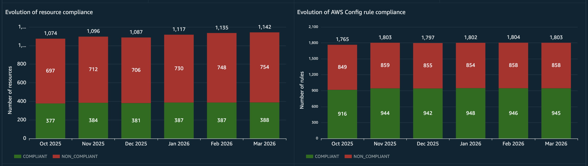
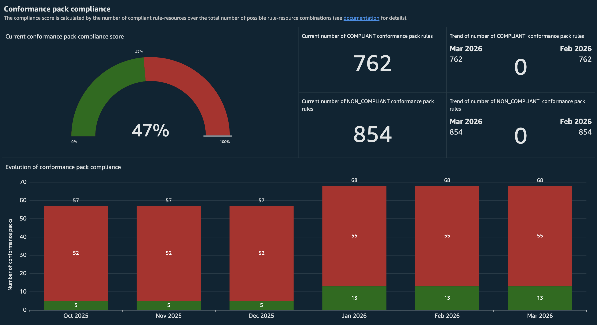
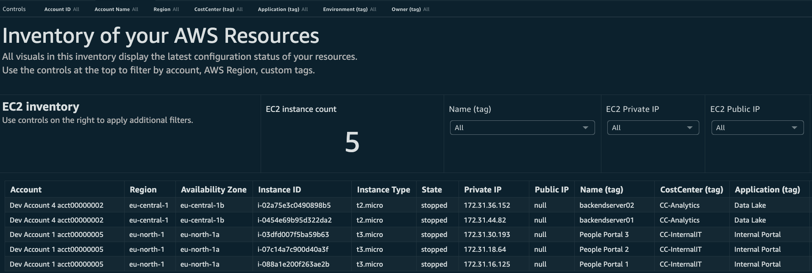
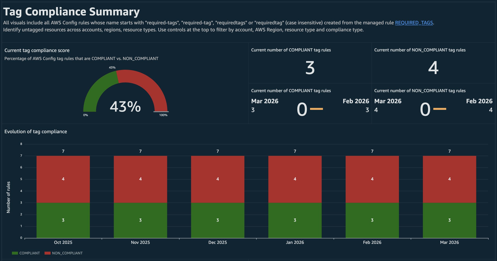
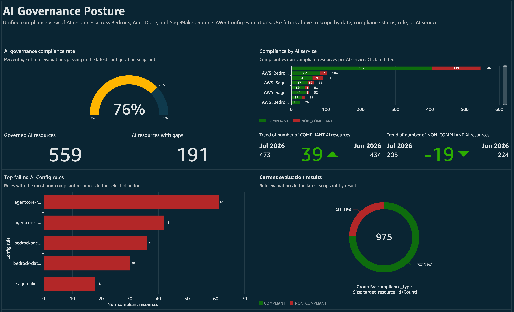
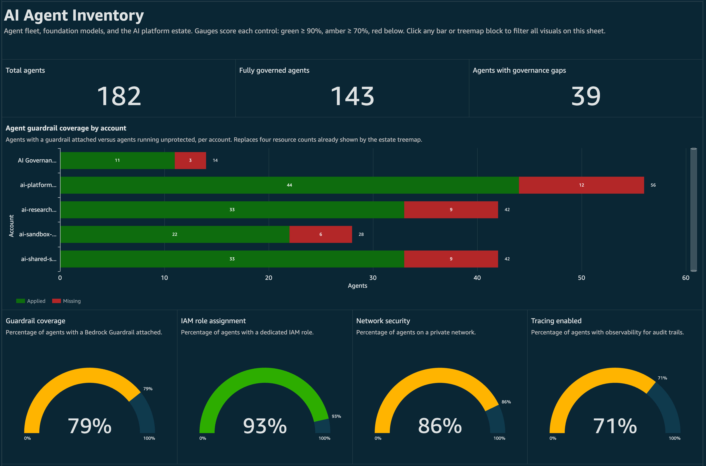
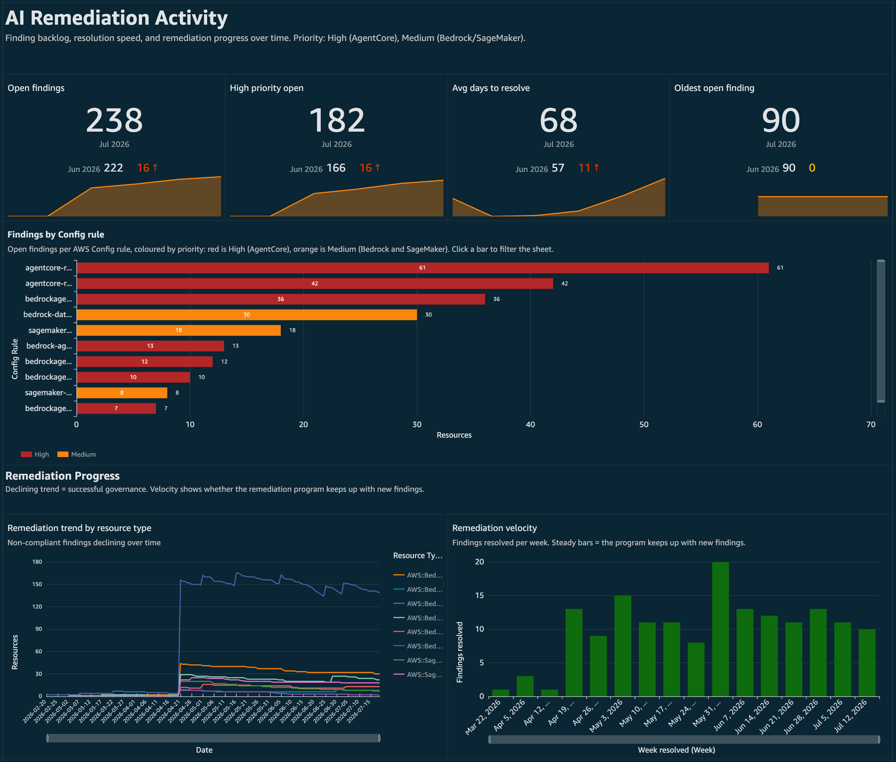

# Cloud Intelligence Dashboards — AWS Config Resource Compliance Dashboard (CRCD)

## About

[AWS Config](https://aws.amazon.com/config/) is a fully managed service that provides you with resource inventory, configuration history, and inventory tracking for security and governance. By actively recording every configuration change across your AWS resources, Config enables continuous compliance auditing, in-depth security analysis, and precise resource change tracking to help you maintain visibility and control over your environment.

The Amazon Web Services (AWS) Config Resource Compliance Dashboard (CRCD) shows the inventory of your AWS resources, along with their compliance status, across multiple AWS accounts and Regions by leveraging your AWS Config data.

### Advantages
The AWS Config Resource Compliance Dashboard addresses significant challenges of AWS customers in maintaining their compliance and security posture and establishing effective resource configuration management practices at scale.

Through this unified platform, organizations can bridge the gap between security oversight and operational execution, creating a more efficient and secure cloud infrastructure management and compliance process. 

Key benefits include:

#### Compliance tracking
Track compliance of your AWS Config rules and conformance packs per service, AWS Region, account, resource. Identify resources that require compliance remediation and establish a process for continuous compliance review. Verify that your tagging strategy is consistently applied across accounts and Regions. Evaluate compliance against risky misconfigurations that can lead to common security incidents.

#### Democratize security and compliance visibility
The AWS Config Dashboard helps security teams establish a compliance practice and offers visibility over security compliance to field teams, without them accessing AWS Config service or dedicated security tooling accounts.

#### Shift-left security and compliance practices
Field teams will see their non-compliant resources as quickly as security teams. This creates a short feedback loop that helps keep non-compliant resources to a minimum and helps organizations establish a consistent compliance review process with a shorter path to get to green compliance.

#### A simplified Configuration Management Database (CMDB) experience in AWS
Avoid investment in a dedicated external CMDB system or third-party tools. Access the inventory of resources in a single pane of glass, without accessing the AWS Management Console on each account and Region. Filter resources by account, Region, and fields that are specific to the resource such as IP address. If you tag consistently your resources — for example to map them to the application, owning team and environment — specify those tags to the dashboard and they will be displayed alongside the other resource-specific information, and used for filtering your configuration items. Manage and plan the upgrade of Amazon RDS DB engines and AWS Lambda runtimes.

#### Optimize AWS Config usage
AWS Config costs can be difficult to attribute without the right visibility. The dashboard surfaces the patterns behind your spending — so you can streamline your AWS Config setup, eliminate redundant evaluations, and maintain the same level of compliance coverage with less overhead.

### Dashboard features

#### AWS Config compliance
- At-a-glance status of compliant and non-compliant resources and AWS Config rules.
- Compliance score for AWS Config rules, conformance packs, and AWS resources.
- Month-by-month compliance trend for resources and AWS Config rules.
- Compliance breakdown by service, account, and Region.
- Compliance tracking for AWS Config rules and conformance packs.

#### Inventory management

Inventory of Amazon EC2, Amazon EBS, Amazon S3, Amazon Relational Database Service (RDS) and AWS Lambda. Visualize your managed EC2 instances and identify instances that are not managed by AWS Systems Manager (SSM). Filter resources by account, Region and resource-specific fields (e.g. IP addresses for EC2). Option to filter resources by the custom tags that you use to categorize workloads, such as Application, Owner and Environment. The name of the tags will be provided by you during installation.

##### Resource inventory and EC2 Availability Zone dashboards
Summarized insights about resource configuration data, including detailed information about EC2 and EBS. Evaluate your resilience to AZ-level events by checking the distribution of your EC2 instances across Availability Zones.

#### Tag compliance
Visualize the results of AWS Config Managed Rule [required-tags](https://docs.aws.amazon.com/config/latest/developerguide/required-tags.html) or one of the several [rules](https://docs.aws.amazon.com/config/latest/developerguide/managed-rules-by-aws-config.html) ending with `-tagged`. You can deploy these rules to find resources in your accounts that were not launched with your desired tag configurations.

#### Understanding AWS Config usage
AWS Config costs are driven by two primary factors: the number of configuration item (CI) changes being recorded and the number of rule evaluations performed over time. Because AWS Config supports multiple recording modes and deployment options, costs can accumulate in ways that are difficult to track without dedicated tooling. Calculating precise Config costs is complex, and the **Config Usage Insights** tab is designed to surface the trends and patterns that matter most — giving you a clear view of how many CI changes are being recorded and how rule evaluations are trending across your environment.

Rule evaluations are triggered continuously in response to resource configuration changes, or periodically based on scheduled checks. AWS Config can be deployed through individual rules, conformance packs, Security Hub standards, and AWS Control Tower controls — and many organizations inadvertently end up with duplicate rules across these deployment methods. This duplication results in redundant evaluations that increase costs without improving compliance coverage, adds governance complexity, and can lead to inconsistent remediation actions for the same compliance issue. Regularly auditing your rules and conformance packs to identify and eliminate this redundancy is one of the most effective ways to reduce Config spending.

Another cost pattern worth monitoring involves conformance pack rules with a compliance status of `INSUFFICIENT_DATA`. These rules have no AWS resources currently in scope, yet evaluations are still triggered — and you are charged for each evaluation regardless of its outcome. Identifying these rules allows you to deactivate them, avoiding charges for evaluations that provide no compliance value.

The **Config Usage Insights** tab provides the visibility needed to address these patterns systematically. By tracking CI recording volumes and rule evaluation counts over time, the dashboard helps you identify where spending is concentrated, surface redundant or inactive rules, and make informed decisions about where to streamline your AWS Config configuration — without compromising your compliance posture.

#### AI Governance
Three dedicated tabs provide a unified view of your AI governance posture across Amazon Bedrock, Amazon Bedrock AgentCore, and Amazon SageMaker — powered by the same AWS Config data pipeline as the rest of the dashboard.

- **AI Governance** — overall AI compliance rate, resources under governance, compliance gaps, compliance breakdown by AI service, governance coverage flow (AI service → AWS Config rule), and compliance trends over time.
- **AI Agent Inventory** — Bedrock AgentCore Runtime fleet: guardrail coverage, IAM role assignment, network security mode, tracing, foundation model distribution, an estate inventory of every AI resource, and a resource relationship map linking agents to the guardrails, IAM roles, models and KMS keys they use.
- **AI Remediation Activity** — open finding backlog, finding aging, time-to-resolve, and prioritized non-compliant AI resources by AWS Config rule and resource type.

All three tabs carry the same Account ID, Account Name and Region filters as the rest of the dashboard. The AI tabs visualize evaluations from the AWS Config managed rules for AI workloads (for example [`BEDROCKAGENTCORE_RUNTIME_PRIVATE_NETWORK_REQUIRED`](https://docs.aws.amazon.com/config/latest/developerguide/bedrockagentcore-runtime-private-network-required.html), [`BEDROCK_DATA_SOURCE_ENCRYPTION_ENABLED`](https://docs.aws.amazon.com/config/latest/developerguide/bedrock-data-source-encryption-enabled.html), [`SAGEMAKER_MODEL_PRIVATE_REGISTRY_REQUIRED`](https://docs.aws.amazon.com/config/latest/developerguide/sagemaker-model-private-registry-required.html), [`SAGEMAKER_ENDPOINT_CONFIG_KMS_KEY_REQUIRED`](https://docs.aws.amazon.com/config/latest/developerguide/sagemaker-endpoint-config-kms-key-required.html)) as well as any custom AWS Config rules you deploy for AI controls. Managed rule availability varies by AWS Region — check the linked documentation for each rule. See [AI Governance module documentation](./documentation/ai-governance.md) for prerequisites and details.

### Additional features
These features work alongside the AWS Config Resource Compliance Dashboard (CRCD) solution.
- Organizational taxonomy - Deploy the [CID Data Collection](https://docs.aws.amazon.com/guidance/latest/cloud-intelligence-dashboards/data-collection.html) to collect organization data. You will be able to add your organizational taxonomy to the dashboard during deployment.
- [Backfill](./backfill/README.md) - Make your compliance history visible on the dashboard right after deployment.
- [Amazon Quick chat agent](./chat_agent/README.md) - Deploy a compliance chat agent that understands your environment and provides contextual insights by using Amazon Quick’s generative AI capabilities powered by your AWS Config dashboard. 

## Architecture
The AWS Config Resource Compliance Dashboard (CRCD) solution can be deployed in standalone AWS accounts or AWS accounts that are members of an AWS Organization. In both cases, AWS Config is configured to deliver configuration files to a centralized Amazon S3 bucket in a dedicated account.

There are two possible ways to deploy the AWS Config Dashboard on AWS Organizations. 

### Deploy in the AWS Config Account
You can deploy the dashboard resources in the same account where your AWS Config configuration files are delivered. The architecture would look like this:

### Deploy in a separate Dashboard Account
Alternatively, you can create a separate Dashboard account to deploy the dashboard resources. In this case, objects from the AWS Config Logs bucket in the Config account are replicated to another bucket in the Dashboard account.

### Deploy on a standalone account
You can also deploy the dashboard in a standalone account with AWS Config enabled. This option may be useful for proof of concept or testing purposes. In this case, all resources are deployed within the same AWS account.

### Architecture details
An Amazon Athena table is used to extract data from the AWS Config configuration files delivered to Amazon S3. Whenever a new object is added to the bucket, the Lambda Partitioner function is triggered. This function checks if the object is an AWS Config configuration snapshot or configuration history file. If it is, the function adds a new partition to the corresponding Athena table with the new data. If the object is neither a configuration snapshot nor configuration history file, the function ignores it.

The solution provides Athena views, which are SQL queries that extract data from Amazon S3 using the schema defined in the Athena table. Finally, you can visualize the data in a Quick Sight dashboard that uses these views through Amazon Quick Sight datasets.

## Deployment
Deployment guide available at the [Cloud Intelligence Dashboards on AWS Implementation Guide](https://docs.aws.amazon.com/guidance/latest/cloud-intelligence-dashboards/config-resource-compliance-dashboard.html).

## Upgrade
Upgrading from an older version? Read [this](./documentation/upgrade.md) first.

## Additional info
Other documentation is available [here](./documentation/README.md).

# Security

See [CONTRIBUTING](CONTRIBUTING.md#security-issue-notifications) for more information.

# License

This library is licensed under the MIT-0 License. See the [LICENSE](LICENSE) file.