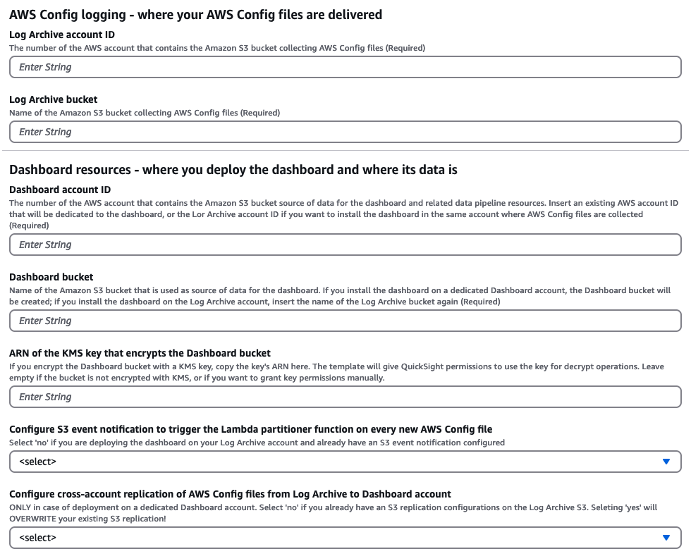

# Cloud Intelligence Dashboards - AWS Config Resource Compliance Dashboard (CRCD) v2.1.0

## Description


The Amazon Web Services (AWS) Config Resource Compliance Dashboard (CRCD) shows the inventory of your AWS resources, along with their compliance status, across multiple AWS accounts and regions by leveraging your AWS Config data.


### Advantages

#### A simplified Configuration Management Database (CMDB) experience in AWS
Avoid investment in a dedicated external CMDB system or third-party tools. Access the inventory of resources in a single pane of glass, without accessing the AWS Management Console on each account and region. Filter resources by account, region, custom tags and IP address. Plan the upgrade of Amazon RDS DB engines and AWS Lambda runtimes.

#### Compliance tracking
Track compliance of your AWS Config rules and conformance packs per service, region, account, resource. Identify resources that require compliance remediation and establish a process for continuous compliance review. Verify that your tagging strategy is consistently applied across accounts and regions.

#### Security visibility
The CRCD dashboard helps security teams establish a compliance practice and offers visibility over security compliance to field teams, without them accessing AWS Config service or dedicated security tooling accounts.


### Dashboard features

#### AWS Config compliance
- At-a-glance status of compliant and non-compliant resources and AWS Config rules
- Month-by-month compliance trend for resources and AWS Config rules
- Compliance breakdown by service, account, and region
- Compliance tracking for AWS Config rules and conformance packs

#### Custom tags support
Inventory of Amazon EC2, Amazon EBS, Amazon S3, Amazon Relational Database Service (RDS) and AWS Lambda resources with filtering on account, region, customizable tags.


The dashboard allows filtering of resources by the custom tags that you use to categorize workloads. The name of the tags will be provided by you during installation.

#### Inventory Dashboard
The AWS Config [inventory dashboard](https://docs.aws.amazon.com/config/latest/developerguide/viewing-the-aggregate-dashboard.html#aggregate-compliance-dashboard) is replicated here, so that you can share it without managing read-only access to the AWS Config console.

#### Tag compliance
Tag compliance collects the results of AWS Config Managed Rule [required-tags](https://docs.aws.amazon.com/config/latest/developerguide/required-tags.html). You can activate this rule as many times as needed, as long as you give it a name that starts with `required-tags`.


## Architecture
The AWS Config Resource Compliance Dashboard (CRCD) solution can be deployed in standalone AWS accounts or AWS accounts that are members of an AWS Organization. In both cases, AWS Config is configured to deliver configuration files to a centralized Amazon S3 bucket in a dedicated Log Archive account.

There are two possible ways to deploy the CRCD dashboard on AWS Organizations. 

1. **Deploy in the Log Archive Account** You can deploy the dashboard resources in the same Log Archive account where your AWS Config configuration files are delivered. The architecture would look like this:


2. **Deploy in a separate Dashboard Account** Alternatively, you can create a separate Dashboard account to deploy the dashboard resources. In this case, objects from the Log Archive bucket in the Log Archive account are replicated to another bucket in the Dashboard account.


You can also deploy the dashboard in a standalone account with AWS Config enabled. This option may be useful for proof of concept or testing purposes. In this case, all resources are deployed within the same AWS account.

An Amazon Athena table is used to extract data from the AWS Config configuration files delivered to Amazon S3. Whenever a new object is added to the bucket, the Lambda Partitioner function is triggered. This function checks if the object is an AWS Config configuration snapshot or configuration history file. If it is, the function adds a new partition to the corresponding Athena table with the new data. If the object is neither a configuration snapshot nor configuration history file, the function ignores it.
By default, the Lambda Partitioner function skips configuration snapshots file. The function has environment variables that can be set to independently enable the partitioning of configuration snapshot or configuration history files.

The solution provides Athena views, which are SQL queries that extract data from Amazon S3 using the schema defined in the Athena table. Finally, you can visualize the data in a QuickSight dashboard that uses these views through Amazon QuickSight datasets.

For more information on how the Lambda Partitioner function recognizes AWS Config files, see [Amazon S3 prefixes for AWS Config files](README.md#amazon-s3-prefixes-for-aws-config-files).


## Before you start

### AWS Config considerations
_Skip this paragraph if you have AWS Config enabled._

* The solution leverages AWS Config data to build the visualizations on the dashboard. If you **do not** have AWS Config enabled, we strongly recommend building your strategy first:
  * Decide which accounts, regions, and resources to monitor.
  * Define what "compliance" means to your organization.
  * Identify the account that will be delegated admin for AWS Config.
  * Keep in mind the paragraphs below when enabling AWS Config.

* Only when the AWS Config setup matches your needs should you consider deploying this dashboard.

### AWS Config delivery channel considerations
The AWS Config delivery channel is a crucial component for managing and controlling where configuration updates are sent. It consists of an Amazon S3 bucket and an optional Amazon SNS topic. The S3 bucket is used to store configuration history files and configuration snapshots, while the SNS topic can be used for streaming configuration changes. Check this [blog post](https://aws.amazon.com/blogs/mt/configuration-history-configuration-snapshot-files-aws-config/) for more information on the difference between AWS Config configuration history and configuration snapshot files.

A delivery channel is required to use AWS Config and is limited to one per region per AWS account. When setting up a delivery channel, customers can specify the name, the S3 bucket for file delivery, and the frequency of configuration snapshot delivery.

To check your AWS Config delivery channel setup, you can use the AWS CLI command `aws configservice describe-delivery-channels`. This command will provide information about your current delivery channel configuration, including the S3 bucket where configuration updates are sent and the configuration snapshot delivery properties. 

The output of the CLI command should look like this:
```
{
    "DeliveryChannels": [
        {
            "name": "[YOUR-DELIVERY-CHANNEL-NAME]",
            "s3BucketName": "[YOUR-LOG-ARCHIVE-BUCKET-NAME]",
            "s3KeyPrefix": "[OPTIONAL-S3-PREFIX-FOR-AWS-CONFIG-FILES]",
            "configSnapshotDeliveryProperties": {
                "deliveryFrequency": "TwentyFour_Hours"
            }
        }
    ]
}
```

Configuration **snapshot** delivery is a key feature of AWS Config's delivery channel. It provides a comprehensive view of all currently active recorded configuration items within a customer's AWS account. In contrast, AWS Config delivers a configuration **history** file to the S3 bucket specified in the delivery channel every 6 hours. This file contains changes detected for each resource type since the last history file was delivered. 

If you only collect configuration history files, you know about a resource and its compliance status only when a change happens to it. On the other hand, by delivering AWS Config snapshot files frequently, you will ensure regular, daily updates of the account's resource configurations, allowing for consistent monitoring and compliance checks. This is why the preferred way to collect data for the dashboard is to have `configSnapshotDeliveryProperties` configured on your delivery channel with a delivery frequency of 24 hours. This is a prerequisite for the AWS Config Resource Compliance Dashboard. We recommend you run the CLI command above to verify your environments are compliant.

AWS Control Tower configures the AWS Config delivery channel with a 24-hour delivery frequency for configuration snapshot files.

#### Add daily delivery of configuration snapshot files to your delivery channel
You have to configure this on every account and region where you have AWS Config active. We'll give an example below of how this can be achieved with the AWS CLI, but if your environment consists of several AWS accounts and regions, we recommend using CloudFormation StackSets to ensure a consistent configuration. 

Here's how you can use the AWS CLI to modify the existing settings and add frequent delivery of configuration snapshot files to your delivery channel configuration. 

1. Log into the AWS Console in any account and region, open AWS CloudShell.
1. Run the AWS CLI command `aws configservice describe-delivery-channels` and save the resulting JSON to a local file. Name it `deliveryChannel.json`. For example, your file may look like the one below. 
```
{
  "name": "default",
  "s3BucketName": "config-bucket-123456789012",
  "snsTopicARN": "arn:aws:sns:us-east-1:123456789012:config-topic",
  "s3KeyPrefix": "my-prefix"
}
```
3. Verify the S3 bucket in `s3BucketName` is the name of your Log Archive bucket.
1. Edit the file to add the `configSnapshotDeliveryProperties` section:
```
{
  "name": "default",
  "s3BucketName": "config-bucket-123456789012",
  "snsTopicARN": "arn:aws:sns:us-east-1:123456789012:config-topic",
  "s3KeyPrefix": "my-prefix",
  "configSnapshotDeliveryProperties": {
    "deliveryFrequency": "TwentyFour_Hours"
  }
}
```

You have to follow these steps consistently in every account and region:
1. Log into the AWS Console of one account and region, open AWS CloudShell.
1. Upload the `deliveryChannel.json` file containing the delivery channel configuration.
1. Use the `put-delivery-channel` AWS CLI [command](https://docs.aws.amazon.com/cli/latest/reference/configservice/put-delivery-channel.html) to update your delivery channel configuration according to the content of the JSON file. This command allows you to update or modify your current delivery channel settings.

```
aws configservice put-delivery-channel --delivery-channel file://deliveryChannel.json
```

It is your responsibility to ensure this is done consistently and according to you priorities and AWS setup.

### Regional considerations
**Data transfer costs will incur when Amazon Athena queries an Amazon S3 bucket across regions.**

* To avoid cross-region data transfer, Amazon QuickSight and the Amazon S3 bucket containing AWS Config files must be deployed in the same region.
* If you have already deployed either resource, the other must use the same region. If you haven't deployed anything yet, you can choose a region of your preference.
* If you have deployed both resources in different regions, we strongly recommend making changes so that both are in the same region.
* Once you have decided on the region, deploy AWS resources supporting the dashboard (via CloudFormation) in the same region.

### AWS Control Tower considerations
* If you enabled AWS Config in all accounts and regions via AWS Control Tower, it may have created a Service Control Policy that denies adding or removing bucket policies on the Log Archive bucket. This control aims to prevent changes to this important bucket.
* However, the IAM role `AWSControlTowerExecution` is exempted by the Service Control Policy and can be used for Control Tower admin tasks. This role is available in all accounts of the organization and can be assumed from the management account to perform operations denied to account administrators.
* Our deployment does not need to add policies to the Log Archive bucket, and we were able to install the dashboard using a local user/role. 
* However, you may have more stringent Service Control Policies on the Log Archive bucket. In that case, we recommend assuming the `AWSControlTowerExecution` IAM role from the management account to perform the deployment of the dashboard.

Read more about the `AWSControlTowerExecution` IAM role in the [documentation](https://docs.aws.amazon.com/controltower/latest/userguide/awscontroltowerexecution.html).

### AWS Key Management Service (KMS) key to encrypt the Log Archive bucket and/or the AWS Config delivery channel 
**It's important to note that this senario is not fully supported by the dashboard.**

If your Log Archive bucket and/or your AWS Config delivery channel are encrypted with a customer managed KMS key, you can proceed with the standard installation, but there are additional manual configuration steps to perform that will be explained below. 

Unless you utilize multi-region KMS keys, it's important that your KMS key is in the same region as the dashboard resources, the Log Archive bucket and QuickSight. 

### Deployment architecture 
The most important decision is whether to install the dashboard on a dedicated Dashboard account or directly into the Log Archive account. These are the implications of each architecture.

#### Log Archive account architecture
| Pros  | Cons   | 
|---|---|
| Keep your logs secure in the Log Archive account.  | Your security team must install and maintain the CRCD Dashboard resources, including user access to QuickSight. Alternatively, you have to share access to the Log Archive account with other teams that will manage these resources. |
| Avoid cost for data transfer and storing data on the Dashboard account.  | The CRCD Dashboard adds complexity in user management if you already have QuickSight dashboards deployed in the Log Archive account. |
|| If you already have S3 object notification configured on your Config bucket, a part of the CRCD installation must be done manually. |

#### Dashboard account architecture
| Pros  | Cons   | 
|---|---|
| Allow your DevOps or external teams independence in installing and maintaining the dashboard, as well as regulating user access.  | Your security data will be copied to another AWS account.  |
| Limited number of resources must be deployed on Log Archive account.| Control Tower default installations may collect AWS Config and AWS CloudTrail on the same bucket. This means that all your security logs will be replicated to another account. |
||You will incur costs for the replication and storing a copy of your data on another Amazon S3 bucket. |
||If you already have S3 replication configured on your Log Archive bucket, a part of the CRCD installation must be done manually. |


## Prerequisites
 
1. AWS Config enabled in the accounts and regions you want to track, with the delivery of AWS Config files set up to a centralized Amazon S3 bucket (the Log Archive bucket) in the Log Archive account. Your AWS Config delivery channel must include the delivery of configuration snapshot files every 24 hours on all accounts and regions where AWS Config is active.
1. An AWS Account where you'll deploy the dashboard (the Dashboard account).
1. IAM Role or IAM User with permissions to deploy the infrastructure using CloudFormation.
1. Sign up for [Amazon QuickSight](https://docs.aws.amazon.com/quicksight/latest/user/signing-up.html) and create a user:
    1. Select **Enterprise** edition.
    2. For the **Get Paginated Reports add-on**, choose the option you prefer (not required for the CRCD dashboard).
    3. **Use IAM federated identities and QuickSight-managed users**.
    4. Select the region where to deploy the dashboard. We recommend using the same region of your Amazon S3 bucket.
    5. Add an username and an e-mail where you'll receive notifications about failed QuickSight datasets updates.
    6. Use the **QuickSight-managed role (default)**.
    7. Don't modify the **Allow access and autodiscovery for these resources** section and click **Finish**.
1. Ensure you have SPICE capacity available in the region where you're deploying the dashboard.


## Deployment Instructions 
The infrastructure needed to collect and process the data is defined in CloudFormation. The dashboard resources are defined in a template file that can be installed using the [CID-CMD](https://github.com/aws-samples/aws-cudos-framework-deployment) tool.

Regardless of the deployment architecture you choose, you will use the same YAML file for the CloudFormation template. Specific input parameters to the template will determine what will be installed.



**Parameter group: AWS Config logging - where your AWS Config files are delivered**

These parameters specify information about your AWS Config setup. They do not change depending on the architecture of your deployment.
* `Log Archive account ID`
  * This is the AWS account ID that contains the Amazon S3 bucket collecting AWS Config files.
* `Log Archive bucket`
  * This is the name of the Amazon S3 bucket collecting AWS Config files.


**Parameter group: CRCD Dashboard - where you deploy the dashboard and where its data is**

These parameters define where you install your dashboard. You can specify the same values as above (for deployment in the Log Archive account) or a different AWS account ID and bucket name (if you chose to deploy in a dedicated Dashboard account).

* `Dashboard account ID`
  * The AWS account ID that contains the Amazon S3 bucket as the source of data for the CRCD dashboard and related data pipeline resources.
* `Dashboard bucket`
  * The name of the Amazon S3 bucket used as the source of data for the CRCD dashboard.
* `Configure S3 event notification to trigger the Lambda partitioner function on every new AWS Config file`
  * This depends on how you are going to install the CRCD dashboard. More details below.
* `Configure cross-account replication of AWS Config files from Log Archive to Dashboard account`
  * This depends on how you are going to install the CRCD dashboard. More details below.

Follow the instructions in one of the paragraphs below, depending on the architecture of choice.

### Installation on standalone account
Follow the same installation instructions for the Log Archive account.

### Installation on Log Archive account
The installation process consists of two steps:
1. Data pipeline resources for the dashboard, via CloudFormation stack.
1. Quicksight resources for the dashboard and the necessary Athena views, using the [CID-CMD](https://github.com/aws-samples/aws-cudos-framework-deployment) command line tool.


#### Deployment Steps
**Ensure you are in the region where both your Log Archive bucket and Amazon QuickSight are deployed.**

##### Step 1
Log into the AWS Management Console for your **Log Archive account**.

1. Open the CloudFormation console and upload the `cloudformation/cid-crcd-resources.yaml` template file. Specify the following parameters:
   - `Stack name` This is up to you, but we recommend using `cid-crcd-resources`.
   - `Log Archive account ID` Enter the AWS account ID where you are currently logged in.
   - `Log Archive bucket` Enter the name of the Amazon S3 bucket that collects AWS Config data.
   - `Dashboard account ID` Enter the same value as the `Log Archive account ID`. 
   - `Dashboard bucket` Enter the same value as the `Log Archive bucket`.
   - `Configure S3 event notification` Select `yes` to configure S3 event notifications. This will trigger the **Partitioner** Lambda function, which will create the corresponding partition on Amazon Athena, when a new AWS Config file is delivered to the Log Archive bucket. Select `no` if you have already configured event notifications on the Log Archive bucket. You'll have to manually configure S3 event notifications (more details below). 
     - The S3 event notification configuration is performed by an ad-hoc Lambda function (**Configure bucket notification** in the diagram above) that will be called by the CloudFormation template automatically. 
     - The **Configure bucket notification** function will return an error (and the entire stack will fail) if you have already configured event notifications on the Log Archive bucket. In this case you must select `no` and run the stack again.
   - `Configure cross-account replication` Leave at the default value. This parameter is ignored in this deployment mode.
   - Leave all other parameters at their default value.
1. Run the CloudFormation template.
1. Note down the output values of the CloudFormation template.

##### Step 2
Remain logged into the AWS Management Console for your **Log Archive account**.


1. Deploy the QuickSight dashboard using the [CID-CMD](https://github.com/aws-samples/aws-cudos-framework-deployment) tool:
   - Navigate to the AWS Management Console and open AWS CloudShell. Ensure to be in the correct region.
   - The tool requires Python 3.
   - Install the latest pip package:
    ```
    python3 -m ensurepip --upgrade
    ```
   - Install the CID-CMD tool:
    ```
    pip3 install --upgrade cid-cmd
    ```
   - On the top right corner, click on `Actions`, and then `Upload file`.
   - Select the `cid-crcd.yaml` file under the `dashboard_template` directory and click on `Upload`.
   - Deploy the dashboard running the following command (replace the parameters accordingly):
     - `--quicksight-datasource-role` The value of the output `QuickSightDataSourceRole` from the CloudFormation template.
     - `--tag1` The name of the first tag you use to categorize workloads.
     - `--tag2` The name of the second tag you use to categorize workloads.
     - `--tag3` The name of the third tag you use to categorize workloads.
     - `--tag4` The name of the fourth tag you use to categorize workloads.
     - Notice that tag parameters are case sensitive and cannot be empty. If you do not use a tag, pass a short default value, e.g. `--tag4 'tag4'`.
     - Leave all other parameters at their default value.
    
    ```
    cid-cmd deploy --resources 'cid-crcd.yaml' --quicksight-datasource-role 'REPLACE-WITH-CLOUDFORMATION-OUTPUT' --tag1 'REPLACE_WITH_CUSTOM_TAG_1' --tag2 'REPLACE_WITH_CUSTOM_TAG_2' --tag3 'REPLACE_WITH_CUSTOM_TAG_3' --tag4 'REPLACE_WITH_CUSTOM_TAG_4' --dashboard-id 'cid-crcd' --athena-database 'cid_crcd_database'  --athena-workgroup 'cid-crcd-dashboard'
    ```

1. The CID-CMD tool will prompt you to select a datasource: `[quicksight-datasource-id] Please choose DataSource (Select the first one if not sure): (Use arrow keys)`. If you have installed other CID/CUDOS dashboards, select the existing datasource `CID-CMD-Athena`. Otherwise select `CID-CMD-Athena <CREATE NEW DATASOURCE>`.
1. When prompted `[timezone] Please select timezone for datasets scheduled refresh.: (Use arrow keys)` select the time zone for dataset scheduled refresh in your region (it is already preselected).
1. When prompted `[share-with-account] Share this dashboard with everyone in the account?: (Use arrow keys)` select the option that works for you.

###### Configure dataset refresh schedule (optional)
By default, the datasets for the CRCD dashboard are refreshed once a day. You can optionally configure the Refresh Schedule in QuickSight with a different frequency:
1. Navigate to QuickSight and then `Datasets`.
1. All the datasets for this dashboard have the prefix `config_`.
1. Click on a dataset, and then open the `Refresh` tab.
1. Click on `ADD NEW SCHEDULE`, select `Full refresh`, and choose the desired frequency.

###### Visualize the dashboard
1. Navigate to QuickSight and then `Dashboards`.
1. Ensure you are in the correct region.
1. Click on the **AWS Config Resource Compliance Dashboard (CRCD)** dashboard.


#### Manual setup of S3 event notification
_Skip this section if you selected_ `yes` _on CloudFormation parameter_ `Configure S3 event notification` _in step 1._

If you selected `no`, you must configure the Log Archive S3 bucket event notification to trigger the Lambda Partitioner function when objects are added to the bucket. CloudFormation has already deployed the necessary permissions for the Lambda function to access the Log Archive bucket. You can find the ARN of the Lambda Partitioner function in the output values of the CloudFormation template.

The S3 event notifications for this dashboard must meet the following requirements:
1. All object create events.
1. All prefixes.

This may be a challenge depending on your current S3 event notification setup, as Amazon S3 [cannot have](https://docs.aws.amazon.com/AmazonS3/latest/userguide/notification-how-to-filtering.html#notification-how-to-filtering-examples-invalid) overlapping prefixes in two rules for the same event type.

We recommend that you configure your event notification to an SNS topic:
* If your bucket publishes events notifications to an SNS topic, [subscribe](https://docs.aws.amazon.com/lambda/latest/dg/with-sns.html#sns-trigger-console) the Lambda Partitioner function to the topic.
* If your bucket sends event notifications to another Lambda function, change the notification to an SNS topic and [subscribe](https://docs.aws.amazon.com/lambda/latest/dg/with-sns.html#sns-trigger-console) both the existing function and the Lambda Partitioner function to that SNS topic.

Follow [these instructions](https://docs.aws.amazon.com/AmazonS3/latest/userguide/how-to-enable-disable-notification-intro.html) to add a notification configuration to your bucket using an Amazon SNS topic. Also, ensure that the Log Archive bucket is [granted permissions to publish event notification messages to your SNS topic](https://docs.aws.amazon.com/AmazonS3/latest/userguide/grant-destinations-permissions-to-s3.html).


#### Manual setup steps in case of KMS key encryption
_Skip this section if you do not utilize a KMS key to encrypt your AWS Config objects._
According to our tests, it is necessary to allow the QuickSite role permissions to use the KMS key for decrypt operations.

We recommend [editing](https://docs.aws.amazon.com/kms/latest/developerguide/key-policy-modifying.html) the KMS key policy of the customer managed key and add the following statement:

```
{
    "Sid": "Allow Quicksight Role access",
    "Effect": "Allow",
    "Principal": {
        "AWS": "arn:aws:iam::ACCOUNT_ID:role/QUICKSIGHT_DATASOURCE_ROLE"
    },
    "Action": [
        "kms:Decrypt"
    ],
    "Resource": "*"
}
```

Where:
- `ACCOUNT_ID` is the AWS account ID where you installed the dashboard.
- `QUICKSIGHT_DATASOURCE_ROLE` is the value of the output `QuickSightDataSourceRole` from the CloudFormation template.

**Remember to delete that statement from the KMS resource policy when you destroy or redeploy the dashboard resources.**

Alternatively, this can be done with a [KMS Key grant](https://docs.aws.amazon.com/kms/latest/developerguide/grants.html).

### Installation on dedicated Dashboard account

The installation process consists of three steps:
1. On the Dashboard account, deploy data pipeline resources for the dashboard using a CloudFormation stack.
1. On the Log Archive account, configure the S3 replication rule that copies AWS Config files from the Log Archive bucket to the Dashboard bucket using a CloudFormation stack.
1. On the Dashboard account, deploy Quicksight resources for the dashboard and the necessary Athena views using the [CID-CMD](https://github.com/aws-samples/aws-cudos-framework-deployment) command line tool.


#### Deployment Steps

**Ensure you are in the region where both your Log Archive bucket and Amazon QuickSight are deployed.**

##### Step 1
Log into the AWS Management Console for your **Dashboard account**.

1. Open the CloudFormation console and upload the `cloudformation/cid-crcd-resources.yaml` template file. Specify the following parameters:
   - `Stack name` This is up to you, but we recommend using `cid-crcd-resources`.
   - `Log Archive account ID` Enter the AWS account ID of the Log Archive account. Notice this in NOT where you are currently logged in.
   - `Log Archive bucket` Enter the name of the Amazon S3 bucket that collects AWS Config data.
   - `Dashboard account ID` Enter the AWS account ID where you are currently logged in.
   - `Dashboard bucket` Enter the name of the Amazon S3 bucket that will collect AWS Config data on the Dashboard account. The CloudFormation template will create this bucket.
   - `Configure S3 event notification` Leave at the default value. This parameter is ignored in this deployment mode.
   - `Configure cross-account replication` Leave at the default value. This parameter is ignored in this deployment mode.
   - Leave all other parameters at their default value.
1. Run the CloudFormation template.
1. Note down the output values of the CloudFormation template.

##### Step 2
Log into the AWS Management Console for your **Log Archive account**.

1. Open the CloudFormation console and upload the `cloudformation/cid-crcd-resources.yaml` template file. Specify the following parameters:
   - `Stack name` This is up to you, but we recommend using `cid-crcd-resources`.
   - `Log Archive account ID` Enter the AWS account ID where you are currently logged in.
   - `Log Archive bucket` Enter the name of the Amazon S3 bucket that collects AWS Config data.
   - `Dashboard account ID` Insert the number of the Dashboard account used at Step 1. 
   - `Dashboard bucket` Insert the bucket name that you specified in this field at Step 1.
   - `Configure S3 event notification` Leave at the default value. This parameter is ignored in this deployment mode.
   - `Configure cross-account replication` Select `yes` to configure S3 replication from the Log Archive bucket to the Dashboard bucket. If you already have configured S3 replication on the Log Archive bucket, select `no`. You'll have to manually configure S3 replication (more details below).
     - The S3 replication configuration is performed by an ad-hoc Lambda function (**Configure bucket replication** in the diagram above) that will be called by the CloudFormation template automatically. 
     - Please notice that if you select `yes`, and you have existing S3 replication configurations, the **Configure bucket replication** function will return an error and the entire stack will fail. In this case you must select `no` and run the stack again.
   - Leave all other parameters at their default value.
1. Run the CloudFormation template.
1. Note down the output values of the CloudFormation template.


##### Step 3
Log back into the AWS Management Console for your **Log Archive account**.

1. Deploy the QuickSight dashboard using the [CID-CMD](https://github.com/aws-samples/aws-cudos-framework-deployment) tool:
   - Navigate to the AWS Management Console and open AWS CloudShell. Ensure to be in the correct region.
   - The tool requires Python 3.
   - Install the latest pip package:
    ```
    python3 -m ensurepip --upgrade
    ```
   - Install the CID-CMD tool:
    ```
    pip3 install --upgrade cid-cmd
    ```
   - On the top right corner, click on `Actions`, and then `Upload file`.
   - Select the `cid-crcd.yaml` file under the `dashboard_template` directory and click on `Upload`.
   - Deploy the dashboard running the following command (replace the parameters accordingly):
     - `--quicksight-datasource-role` The value of the output `QuickSightDataSourceRole` from the CloudFormation template.
     - `--tag1` The name of the first tag you use to categorize workloads.
     - `--tag2` The name of the second tag you use to categorize workloads.
     - `--tag3` The name of the third tag you use to categorize workloads.
     - `--tag4` The name of the fourth tag you use to categorize workloads.
     - Notice that tag parameters are case sensitive and cannot be empty. If you do not use a tag, pass a short default value, e.g. `--tag4 'tag4'`.
     - Leave all other parameters at their default value.

    ```
    cid-cmd deploy --resources 'cid-crcd.yaml' --quicksight-datasource-role 'REPLACE-WITH-CLOUDFORMATION-OUTPUT' --tag1 'REPLACE_WITH_CUSTOM_TAG_1' --tag2 'REPLACE_WITH_CUSTOM_TAG_2' --tag3 'REPLACE_WITH_CUSTOM_TAG_3' --tag4 'REPLACE_WITH_CUSTOM_TAG_4' --dashboard-id 'cid-crcd' --athena-database 'cid_crcd_database'  --athena-workgroup 'cid-crcd-dashboard'
    ```
1. The CID-CMD tool will prompt you to select a datasource: `[quicksight-datasource-id] Please choose DataSource (Select the first one if not sure): (Use arrow keys)`. If you have installed other CID/CUDOS dashboards, select the existing datasource `CID-CMD-Athena`. Otherwise select `CID-CMD-Athena <CREATE NEW DATASOURCE>`.
1. When prompted `[timezone] Please select timezone for datasets scheduled refresh.: (Use arrow keys)` select the time zone for dataset scheduled refresh in your region (it is already preselected).
1. When prompted `[share-with-account] Share this dashboard with everyone in the account?: (Use arrow keys)` select the option that works for you.


###### Configure dataset refresh schedule (optional)
By default, the datasets for the CRCD dashboard are refreshed once a day. You can optionally configure the Refresh Schedule in QuickSight with a different frequency:
1. Navigate to QuickSight and then `Datasets`.
1. All the datasets for this dashboard have the prefix `config_`.
1. Click on a dataset, and then open the `Refresh` tab.
1. Click on `ADD NEW SCHEDULE`, select `Full refresh`, and choose the desired frequency.


###### Visualize the dashboard
1. Navigate to QuickSight and then `Dashboards`.
1. Ensure you are in the correct region.
1. Click on the **AWS Config Resource Compliance Dashboard (CRCD)** dashboard.


#### Manual setup steps in case of KMS key encryption
_Skip this section if you do not utilize a KMS key to encrypt your AWS Config objects._
According to our tests, it is necessary to allow the QuickSite role permissions to use the KMS key for decrypt operations.

We recommend [editing](https://docs.aws.amazon.com/kms/latest/developerguide/key-policy-modifying.html) the KMS key policy of the customer managed key and add the following statement:

```
{
    "Sid": "Allow Quicksight Role access",
    "Effect": "Allow",
    "Principal": {
        "AWS": "arn:aws:iam::ACCOUNT_ID:role/QUICKSIGHT_DATASOURCE_ROLE"
    },
    "Action": [
        "kms:Decrypt"
    ],
    "Resource": "*"
}
```

Where:
- `ACCOUNT_ID` is the AWS account ID where you installed the dashboard.
- `QUICKSIGHT_DATASOURCE_ROLE` is the value of the output `QuickSightDataSourceRole` from the CloudFormation template.

**Remember to delete that statement from the KMS resource policy when you destroy or redeploy the dashboard resources.**

Alternatively, this can be done with a [KMS Key grant](https://docs.aws.amazon.com/kms/latest/developerguide/grants.html).

#### Manual setup of S3 replication
_Skip this section if you selected_ `yes` _on CloudFormation parameter_ `Configure cross-account replication` _in step 2._

**If your Log Archive bucket is encrypted with a KMS key, you have to handle the [replication of the encrypted objects](https://docs.aws.amazon.com/AmazonS3/latest/userguide/replication-config-for-kms-objects.html) to the Dashboard bucket.**


Log onto the Log Archive Account and open the Amazon S3 console. You can replicate AWS Config files from the centralized Log Archive bucket to the Dashboard bucket through an Amazon S3 Replication configuration, follow these [instructions](https://docs.aws.amazon.com/AmazonS3/latest/userguide/replication-walkthrough-2.html). 
* Specify the IAM role created by the CloudFormation template at step 2, as reported in the output values of the CloudFormation template.


## Destroy dashboard resources

Follow these steps to destroy the dashboard, based on your deployment type.

### All deployment types

1. Log into the AWS Console of the account where you deployed the dashboard. This is the AWS account ID that you specified in the `Dashboard account ID` parameter of the CloudFormation template.
1. Open AWS CloudShell in the region where the dashboard is deployed.
1. Execute the following command to delete the dashboard:

```
cid-cmd delete --resources cid-crcd.yaml
```

* `cid-crcd.yaml` is the template file provided in the `dashboard_template` directory. Upload it to CloudShell if needed.

4. When prompted:
   - Select the `[cid-crcd] AWS Config Resource Compliance Dashboard (CRCD)` dashboard.
   - For each QuickSight dataset, choose `yes` to delete the dataset.
   - Accept the default values for the S3 Path for the Athena table.
   - Accept the default values for the four tags.
   - For each Athena view, choose `yes` to delete the dataset.


### Installation on Log Archive or standalone account
1. Log into the AWS Console of the account where you deployed the dashboard resources with CloudFormation. This is the AWS account ID that you specified both in the `Log Archive account ID` and the `Dashboard account ID` parameters of the CloudFormation template.
1. Open the S3 console and empty the Amazon S3 bucket for the Athena Query results. The bucket name is in the CloudFormation stack output.
1. In the same account, open CloudFormation and delete the stack that installed the data pipeline resources for the dashboard.
1. Revert any manual change made on this account during setup.

### Installation on dedicated Dashboard account

1. Log into the AWS Console of the Log Archive account. This is the AWS account ID that you specified in the `Log Archive account ID` parameter of the CloudFormation template.
1. Open CloudFormation and delete the stack that installed the resources for the dashboard.
1. Revert any manual change made on this account during setup.

1. Log into the AWS Console of the account where you deployed the dashboard resources with CloudFormation. This is the AWS account ID that you specified in the `Dashboard account ID` parameter of the CloudFormation template.
1. Open the S3 console and empty the Amazon S3 bucket for the Athena Query results. The bucket name is in the CloudFormation stack output.
1. Empty the Dashboard bucket, as well. This bucket contains a copy of the AWS Config files from the Log Archive account. The bucket name is in the CloudFormation stack output.
1. In the same account, open CloudFormation and delete the stack that installed the data pipeline resources for the dashboard.
1. Revert any manual change made on this account during setup.

# Additional Information

## Amazon S3 prefixes for AWS Config files

The dashboard uses these sources to get the inventory of resources and their compliance with AWS Config Rules and Conformance Packs: AWS Config configuration history and configuration snapshot files. Check this [blog post](https://aws.amazon.com/blogs/mt/configuration-history-configuration-snapshot-files-aws-config/) for more on the difference between AWS Config configuration history and configuration snapshot files.


The solution supports the following ways of activating AWS Config:
1. Manual setup on standalone AWS accounts.
1. Deployment by AWS Control Tower on AWS Organizations.

These options have different ways of structuring the prefixes of the AWS Config files on Amazon S3. They are defined below, and the Lambda Partitioner function supports all of them.

**Verify that your setup is compatible with these Amazon S3 prefixes.** If not, the Lambda Partitioner function will not be able to recognize objects as valid AWS Config files and will discard them. As a consequence, your Athena table will be empty.


### Supported AWS Config prefixes on Amazon S3

#### Manual AWS Config setup 
`AWSLogs/ACCOUNT-ID/Config/REGION/YYYY/MM/DD/ConfigSnapshot/ACCOUNT-ID_Config_REGION_ConfigSnapshot_TIMESTAMP_RANDOM.json.gz`

`AWSLogs/ACCOUNT-ID/Config/REGION/YYYY/MM/DD/ConfigHistory/ACCOUNT-ID_Config_REGION_ConfigHistory_RESOURCE-ID_TIMESTAMP_RANDOM.json.gz`

#### AWS Control Tower deployment
`AWS-ORGANIZATION-ID/AWSLogs/ACCOUNT-ID/Config/REGION/YYYY/MM/DD/ConfigSnapshot/ACCOUNT-ID_Config_REGION_ConfigSnapshot_TIMESTAMP_RANDOM.json.gz`

`AWS-ORGANIZATION-ID/AWSLogs/ACCOUNT-ID/Config/REGION/YYYY/MM/DD/ConfigHistory/ACCOUNT-ID_Config_REGION_ConfigHistory_RESOURCE-ID_TIMESTAMP.json.gz`

Where:
* `AWS-ORGANIZATION-ID` is the identifier of your AWS Organization.
* `ACCOUNT-ID` is the 12-digit AWS Account number, e.g. 123412341234.
* `REGION` identifies an AWS region, e.g. us-east-1.
* `YYYY/MM/DD` represents a date, e.g. 2024/04/18.
* `TIMESTAMP` is a full timestamp, e.g. 20240418T054711Z.
* `RESOURCE-ID` identifies the resource affected by the ConfigHistory record, e.g. AWS::Lambda::Function.
* `RANDOM` is a sequence of random character, e.g. a970aeff-cb3d-4c4e-806b-88fa14702hdb.

### Partitioning AWS Config files
The Lambda Partitioning function has environment variables that activate the partitioning of AWS Config configuration history and configuration snapshot files separately. The parameters are called:
* `PARTITION_CONFIG_SNAPSHOT_RECORDS`
* `PARTITION_CONFIG_HISTORY_RECORDS`

Pass `1` as value to enable, or `0` to disable the partitioning of the corresponding AWS Config file. By default, in accordance with our prerequisite to leverage AWS Config configuration snapshot files, AWS Config configuration history records are disabled.

# Security

See [CONTRIBUTING](CONTRIBUTING.md#security-issue-notifications) for more information.

# License

This library is licensed under the MIT-0 License. See the LICENSE file.