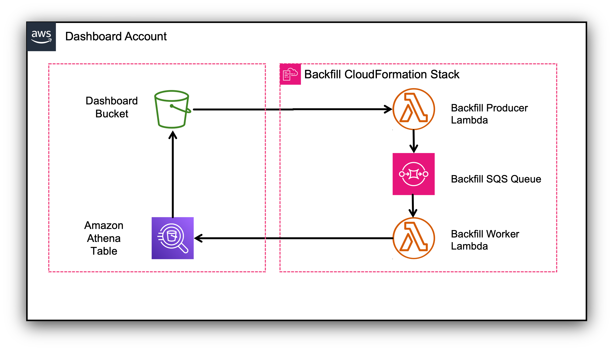

# AWS Config Resource Compliance Dashboard (CRCD) - Backfill Process

## Overview

The backfill feature processes historical AWS Config records that already exist in your Dashboard bucket and creates the necessary Athena/Glue partitions. This is essential to show your historical compliance on the dashboard when you have existing AWS Config records at the time the dashboard was first deployed.

The backfill process will generate partitions for these AWS Config records:
1. All AWS Config history records for the previous 12 months.
2. AWS Config snapshot records on all accounts an regions whose date is the last day of the month, for the previous 5 months.
3. AWS Config snapshot records on all accounts and regions whose date is within the last 5 days.


## Architecture
The solution is installed on the same account and Region where the dashboard resources are deployed. The backfill process uses a two-stage approach:
1. **Producer Lambda Function**: Scans the Dashboard bucket to identify AWS Config prefixes.
2. **Worker Lambda Function**: Creates Athena/Glue partitions for the identified prefixes.
3. **SQS Queue**: Coordinates the workflow between producer and worker functions.



The producer function scans your Dashboard bucket and finds all prefixes related to AWS Config, therefore identifying all the accounts and Regions that are tracked by AWS Config. 

The prefix structure of an AWS Config file is as follows (for an AWS Config Snapshot): `ORG-ID/AWSLogs/ACCOUNT-NUMBER/Config/REGION/YYYY/MM/DD/ConfigSnapshot/objectname.json.gz`. For performance reasons, this function identifies all AWS Config prefixes down to `REGION`. These prefixes are sent to an SQS queue that will trigger the worker function to add them to the dashboard data.

The backfill worker function is triggered by SQS. The payload to the function is an AWS Config prefix until the region, i.e. `ORG-ID/AWSLogs/ACCOUNT-NUMBER/Config/REGION/`. This function will create full AWS Config prefixes adding the `YYYY/MM/DD/(ConfigSnapshot/ConfigHistory/)` part until a configurable time in the past. For each complete prefix, the function will check whether that prefix exists on the S3 Dashboard bucket, in which case the Athena partition will be created (if not already existing).


## Prerequisites

- CRCD Dashboard must already be deployed.
- AWS Config historical data exists in your S3 bucket.
- Deploy this template in the same AWS account and region as your CRCD resources.

## Deployment Instructions

1. Log into the AWS Management Console for your Dashboard account.
1. Ensure you are in the same Region where you deployed the AWS Config dashboard resources.
1. Click this [deploy link](https://console.aws.amazon.com/cloudformation/home#/stacks/create/review?&templateURL=https://aws-managed-cost-intelligence-dashboards.s3.amazonaws.com/cfn/crcd-backfill-resources.yaml&stackName=config-dashboard-backfill) to open the stack template in your CloudFormation Console. This stack will create the dashboard backfilling resources.

4. Configure the following parameters:

### Required Parameters

| Parameter | Description | Example Value |
|-----------|-------------|---------------|
| **DashboardBucketName** | Name of the S3 bucket containing your AWS Config data | `my-config-dashboard-bucket` |
| **AthenaQueryResultBucketName** | S3 bucket for Athena query results (from CRCD stack outputs with key `AthenaQueryResultBucketName`) | `crcd-athena-query-results-ACCOUNT-REGION` |

### Optional Parameters

| Parameter | Default Value | Description |
|-----------|---------------|-------------|
| **AWSOrganizationID** | _(empty)_ | Your AWS Organization ID. Leave empty for standalone accounts. |

5. Run the CloudFormation template.
6. Open the producer function and run it
   - Open the Lambda Console and click on the function `crcd-config-backfill-producer`
   - Click on the **Test** tab.
   - Select **Create new event** under **Test event action**.
   - Click on the **Test** button. The backfill process will start.
   - Monitor CloudWatch logs for the Lambda functions.
   - Check SQS queue metrics to track progress.
1. Verify Results. Query your Athena tables to confirm historical data is accessible. This SQL will return the earliest Config history and snapshot records in your data:
   ```
   select min(dt), datasource from cid_crcd_config group by datasource;
   ```
1. (OPTIONAL) [Refresh](https://docs.aws.amazon.com/quicksuite/latest/userguide/refreshing-imported-data.html) your Quick Suite datasets to see historical data on the dashboard. The datasets will refresh within 24 hours anyway.

## Important Notes

- This is a one-time operation for processing historical data.
- The process may take several hours depending on the amount of historical data.
- You can run the backfill process several times, the worker function will skip creating a partition if it already exists.
- Resources can be deleted after successful backfill completion.
- Ensure sufficient Lambda execution time and SQS message retention for large datasets.