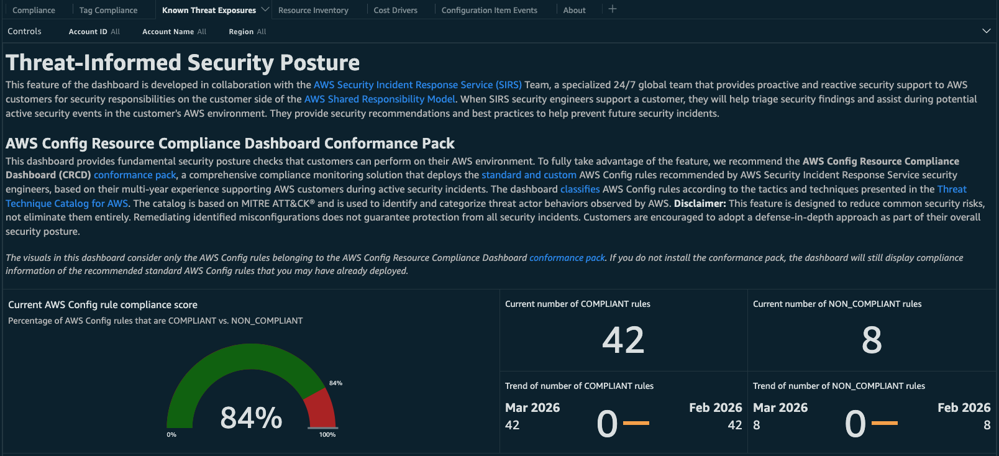

# Threat-Informed Security Posture with AWS Security Incident Response

The [AWS Security Incident Response](https://aws.amazon.com/security-incident-response/) team is a specialized 24/7 global team that provides proactive and reactive security support to AWS customers for security responsibilities on the customer side of the [AWS Shared Responsibility Model](https://aws.amazon.com/compliance/shared-responsibility-model/). When AWS Security Incident Response security engineers support a customer, they will help triage security findings and assist during potential active security events in the customer's AWS environment. They provide security recommendations and best practices to help prevent future security incidents.

This feature of the AWS Config Dashboard was developed in collaboration with AWS Security Incident Response security experts, drawing on their multi-year experience supporting AWS customers during active security incidents. It uses AWS Config rules recommended by security engineers to identify preventable, common misconfigurations that are known to create vulnerabilities exploited in attacks against AWS environments. Addressing these misconfigurations helps eliminate the low-hanging fruit that bad actors frequently target when attempting to gain unauthorized access.

**Please note:** Resolving these misconfigurations significantly reduces your attack surface, but does not guarantee complete protection against security incidents. Additional security controls, monitoring, and practices are recommended as part of a comprehensive security strategy.

## CRCD Threat-Informed Conformance Pack 
The AWS Config Resource Compliance Dashboard Threat-Informed Conformance Pack is a comprehensive compliance monitoring solution that deploys the AWS Config rules recommended by Security Incident Response Service security engineers.

The **Threat-Informed Security Compliance** tab will display compliance status of the [standard and custom AWS Config rules](./crcd-conformance-pack-specification.md) in the conformance pack. The dashboard classifies AWS Config rules according to the tactics and techniques presented in the [Threat Technique Catalog for AWS](https://aws-samples.github.io/threat-technique-catalog-for-aws/). The catalog is based on MITRE ATT&CK® and is used to identify and categorize threat actor behaviors observed by AWS. If you do not install the conformance pack, the dashboard will still display compliance of the [recommended standard AWS Config rules](./crcd-conformance-pack-specification.md) that you may have already deployed.

### Features
- **Recommended Rules**: Includes standard AWS Config managed rules and custom Lambda-based rules recommended by AWS Security Incident Response security engineers.
- **Threat Technique Catalog Classification**: Each rule is classified according to the Threat Technique Catalog for AWS (based on MITRE ATT&CK®).
- **Flexible Deployment**: Supports both AWS Organizations (organization-wide deployment) and standalone AWS accounts.
- **Multi-Region Support**: Deploys across all AWS Regions where AWS Config is enabled.
- **Automatic Updates**: In case of organization-wide deployment, new accounts joining the AWS Organization automatically receive the conformance pack.

## Architecture

### Deployment Modes

#### Organization-Wide Deployment
- Deploy from Management account or delegated administrator.
- Uses CloudFormation StackSets with automatic deployment enabled.
- Deploys to all accounts and Regions automatically.
- New accounts receive the conformance pack automatically via StackSet configuration.

#### Standalone Account Deployment
- Uses the same template as above, tailored to deploy the conformance pack in a single account.
- Deploys in all Regions of the account.

### Conformance Pack Composition
The solution deploys two conformance packs:
- **CRCD-Threat-Informed-Security-Compliance** containing all standard AWS Config rules deployed in all Regions and all accounts of your organization.
- **CRCD-Threat-Informed-Security-Compliance-IAM** containing all rules that apply to AWS Identity and Access Management (IAM) resources, including the custom rules. Since IAM resources are global, these rules can be deployed on one Region to avoid redundancy and optimize cost.

The conformance packs support all parameters exposed by standard AWS Config rules and manages automatically regional availability of rules - i.e. you can deploy the conformance pack in all Regions where AWS Config is enabled, and if a rule is not available in a Region, it will be automatically skipped.

## Prerequisites

### Any deployment mode:
- **AWS Config**: Must be enabled in target accounts and Regions.

### Organization-Wide Deployment:
- **AWS Config** enabled organization-wide.
- **Service-Managed StackSets**: [Enable trusted access](https://docs.aws.amazon.com/organizations/latest/userguide/services-that-can-integrate-cloudformation.html#integrate-enable-ta-cloudformation) for CloudFormation StackSets in AWS Organizations.
- Deploy from an account designated as the deletaged administrator of both [AWS CloudFormation](https://docs.aws.amazon.com/AWSCloudFormation/latest/UserGuide/stacksets-orgs-delegated-admin.html) and [AWS Config](https://docs.aws.amazon.com/config/latest/developerguide/aggregated-register-delegated-administrator.html) (recommended), or from the payer account of your organization.

# Deploy Instructions

## Step 1
1. Log into the AWS Management Console for your account or delegated admin for AWS CloudFormation and AWS Config of your organization.
1. Select a Region that will be the base Region for your deployment and where you will deploy the IAM-related rules of your Conformance Pack.
1. Click the Launch Stack button below to open the stack [template](https://console.aws.amazon.com/cloudformation/home#/stacks/create/review?&templateURL=https://aws-managed-cost-intelligence-dashboards.s3.amazonaws.com/cfn/crcd-conformance-pack-stack.yaml&stackName=crcd-conformance-pack-resources) in your CloudFormation console. 

4. Specify the following parameters:
   - `Deployment mode` Choose deployment mode: `AWS Organizations` for organization-wide deployment (all accounts and Regions), or `Standalone` for single-account, multi-region deployment.
   - `Deployment account type` Choose type of deployment account (the current account). Select `Delegated Admin` if this account is the AWS Config and AWS CloudFormation delegated admin, or `Management Account` if you run this template from the management account of your AWS Organization. This parameter is used only when deployment mode is `AWS Organizations`.
   - `Target Organization Root or Organizational Unit IDs` Enter the root OU ID (`r-xxxx`) to deploy to all accounts of your organization, or specify a comma-separated list of Organizational Unit IDs (`ou-xxxx-xxxxxxxx`) to deploy to. This parameter is used only when deployment mode is `AWS Organizations`.
   - `Accounts to exclude` A comma-separated list of accounts that will not receive the organization conformance pack (leave empty to deploy to all accounts). **Make sure you add here any account ID where AWS Config is not enabled, otherwise the entire stack will fail**. This parameter is used only when deployment mode is `AWS Organizations`.
   - `Deployment Regions` Enter a comma-separated list of Regions where AWS Config is enabled and the conformance pack should be deployed. **Make sure you specify only AWS Regions where AWS Config is enabled in the accounts in scope, otherwise the entire stack will fail**.
1. Specify the parameters to the custom AWS Config rules in the following CloudFormation parameters:
   - `Root Account Not Used Regularly rule: root account usage threshold (days)` Custom rule `crcd-ia-iam-iam-root-not-used-regularly` checks that the root user is not used regularly by looking when it was used last. This parameter specifies the number of days to look back for root account usage. If root was used within this threshold, the rule is marked NON_COMPLIANT.
1. Specify the parameters to the standard AWS Config rules in the following CloudFormation parameters. Follow the provided links for documentation of what these parameters are:
   - Parameter of rule [S3_BUCKET_LEVEL_PUBLIC_ACCESS_PROHIBITED](https://docs.aws.amazon.com/config/latest/developerguide/s3-bucket-level-public-access-prohibited.html):
     - `S3 Bucket-Level Public Access Prohibited rule: excluded public buckets`
   - Parameter of rule [S3_ACCESS_POINT_PUBLIC_ACCESS_BLOCKS](https://docs.aws.amazon.com/config/latest/developerguide/s3-access-point-public-access-blocks.html):
     - `S3 Access Point Public Access Block rule: excluded access points`
   - Parameters of rule [S3_ACCOUNT_LEVEL_PUBLIC_ACCESS_BLOCKS_PERIODIC](https://docs.aws.amazon.com/config/latest/developerguide/s3-account-level-public-access-blocks-periodic.html):
     - `S3 Account-Level Public Access Block rule: enforce option IgnorePublicAcls`
     - `S3 Account-Level Public Access Block rule: enforce option BlockPublicPolicy`
     - `S3 Account-Level Public Access Block rule: enforce option BlockPublicAcls`
     - `S3 Account-Level Public Access Block rule: enforce option RestrictPublicBuckets`
   - Parameters of rule [VPC_SG_PORT_RESTRICTION_CHECK](https://docs.aws.amazon.com/config/latest/developerguide/vpc-sg-port-restriction-check.html):
     - `VPC Security Group Port Restriction Check rule: restricted ports`
     - `VPC Security Group Port Restriction Check rule: protocol type`
     - `VPC Security Group Port Restriction Check rule: exclude external security groups`
     - `VPC Security Group Port Restriction Check rule: IP type`
1. Leave all other parameters at their default value.
1. Run the CloudFormation template.

# Update Instructions

To update the parameters of the AWS Config rules of the template open the CloudFormation stack in the main Region and update the stack. Changes propagate automatically to all accounts and Regions.

# References
- [Threat Technique Catalog for AWS](https://aws-samples.github.io/threat-technique-catalog-for-aws/).
- [MITRE ATT&CK® Framework](https://attack.mitre.org/).
- [AWS Config Rules](https://docs.aws.amazon.com/config/latest/developerguide/managed-rules-by-aws-config.html).
- [AWS Security Incident Response service](https://aws.amazon.com/security-incident-response/).
- [Specification of all AWS Config and custom rules](./crcd-conformance-pack-specification.md) that will be deployed as part of the conformance pack.
- [Cloud Formation template](./crcd-conformance-pack-stack.yaml) to deploy the conformance pack and the related AWS resources. 
