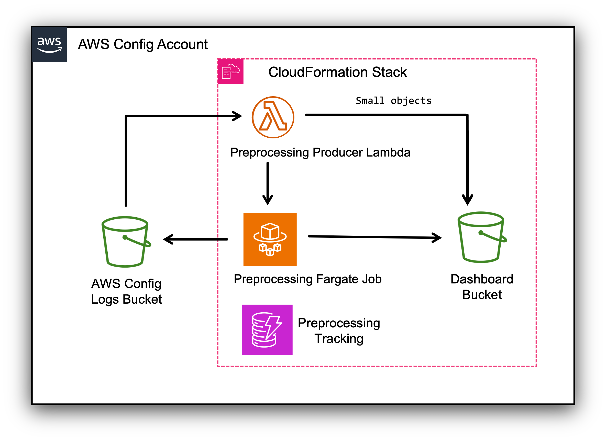

# Pre-processing Security Architecture

This document records the security design decisions for the AWS Config Resource Compliance
Dashboard (CRCD) pre-processing feature, deployed by `crcd-config-preprocessing.yaml`.

## Purpose of the pre-processing feature

In environments with many resources, AWS Config can deliver files larger than 32 MB
(uncompressed), which exceeds an Athena service limit and causes dashboard queries to fail.
The pre-processing feature watches the AWS Config Logs bucket and produces smaller,
Athena-friendly files in a separate Dashboard bucket. It has two runtime components:

- A **Producer Lambda function** that reacts to each new AWS Config file.
- A **Fargate task** that streams and splits the large files.

The flow of data is as follows:
1. **New Config record** lands in the source S3 bucket, the AWS Config Logs bucket.
2. **S3 event notification** triggers the Preprocessing Producer Lambda.
3. **Producer Lambda** checks the compressed file size:
   - **Below threshold** (< 200 KB): copies the file directly to the Dashboard Bucket.
   - **Above threshold** (>= 200 KB): launches a Fargate task.
4. **Fargate task** streams the large file, splits it into files of 500 `configurationItems` each, and writes them to the Dashboard Bucket.
5. **DynamoDB** tracks job status (STARTED → COMPLETED/FAILED) for both paths.

The core principle behind the design: **the only component that transports AWS Config file
*contents* over its own network path is the Fargate task**, so that is where the network
hardening is concentrated. Everything else either handles metadata only or moves data
server-side within AWS.

---

## 1. Producer Lambda function

The Producer Lambda (`ConfigFilePreprocessingProducerLambda`) is triggered by an S3 event
notification whenever AWS Config delivers a new file to the AWS Config Logs bucket.

### What it does

For each new object it parses the S3 key to confirm it is an AWS Config file
(`ConfigSnapshot` / `ConfigHistory`), then branches on object size using the
`CONFIG_OBJECT_SIZE_THRESHOLD_BYTES` environment variable (default **200,000 bytes**):

- **Small files (below the threshold):** the Lambda performs a **server-to-server S3 copy**
  (`s3:CopyObject` with a `CopySource`) directly from the AWS Config Logs bucket to the
  Dashboard bucket. This is an important security property: the object bytes are copied
  **inside S3** and never transit the Lambda's own network path. The Lambda handles no file
  content in this path — it only issues the copy API call and records the result.
- **Large files (at or above the threshold):** the Lambda launches a Fargate task
  (`ecs:RunTask`) to perform the streaming split, passing the source path, destination bucket,
  tracking table name, and a job run ID as container environment overrides.

Every action is recorded in a DynamoDB tracking table (`CRCDJobTrackingTable`) with a status
(`COMPLETED`, `STARTED`, `FAILED`), timestamps, object size, and a 90-day TTL.

### What it has access to

The Lambda's execution role (`IAMRoleConfigFilePreprocessingProducerLambda`) grants only:

| Action | Resource | Purpose |
|---|---|---|
| `dynamodb:PutItem`, `dynamodb:UpdateItem` | `CRCDJobTrackingTable` | Job tracking |
| `ecs:RunTask` | `PreProcessingTaskDefinition` | Launch the split task for large files |
| `iam:PassRole` | Task execution role + task role | Required to run the Fargate task |
| `s3:GetObject` | `${ConfigBucketName}/*` | Read source files (for the copy) |
| `s3:PutObject` | `${DashboardBucket}/*` | Write the copied small files |
| CloudWatch Logs (via `AWSLambdaBasicExecutionRole`) | Log group | Function logs |

### Network posture

The Producer Lambda is **not attached to a VPC** (`SubnetIds: []`). Like the partitioner
Lambda in the main dashboard stack, it runs on the AWS-managed Lambda network and reaches the
AWS service APIs (S3, DynamoDB, ECS) over their public endpoints. This is consistent with the
networking standard already established by the main stack, and it is acceptable here because:

- The small-file path uses a **server-side S3 copy**, so no Config file content flows across
  the Lambda's network.
- All other calls are AWS control-plane API calls (launch task, write tracking record), not
  transfers of sensitive Config data.

Therefore no VPC or VPC endpoints were introduced for the Producer Lambda.

---

## 2. Fargate task

The Fargate task (`PreProcessingTaskDefinition`, container `crcd-preprocessing`) is the only
component that moves AWS Config file **contents** over the network: it streams the large source
object down from the AWS Config Logs bucket (`s3:GetObject`), splits it in memory, and writes
the smaller output objects to the Dashboard bucket (`s3:PutObject`), updating the DynamoDB
tracking table as it goes.

Because it carries the sensitive payload, the network path of the Fargate task is the focus of
the hardening described below.

### Why the task needs internet access

The task image is the public `public.ecr.aws/docker/library/python:3.12-slim`, and at startup
it runs `pip install ijson boto3` from PyPI. Both are **downloads of public software from
outside AWS** and require outbound internet access. No AWS Config data leaves over this path —
only public image layers and Python packages come *in*. Building a private, dependency-baked
image was intentionally rejected to avoid requiring customers to build and push their own
container image.

### Why we created our own VPC

The task must run in a subnet, but the main dashboard stack never creates customer networking,
and we did not want the customer to supply (or us to modify) their existing VPC, subnets, or
route tables. Several intermediate options were evaluated and rejected:

- **Customer-provided subnets + security group:** requires networking parameters and, more
  importantly, attaching our gateway endpoints to the customer's route tables — which would
  route *all* S3/DynamoDB traffic in those subnets through our endpoints and could break other
  workloads via our scoped endpoint policies.
- **Creating subnets inside the customer's VPC:** removes some risk but still needs
  non-overlapping CIDRs and knowledge of the customer's Internet Gateway.

The chosen design is a **dedicated, self-contained VPC** created by the stack
(`PreProcessingVPC`, `10.0.0.0/24`). This has the least impact on the customer's environment:

- No customer networking inputs are required at all (no VPC/subnet/route-table parameters).
- Nothing the customer owns is read or modified.
- The gateway endpoints attach only to our own route table, so their scoped policies cannot
  affect any other workload in the account.
- Egress is self-contained: we create and attach our own Internet Gateway, with no assumptions
  about the customer's networking.

It is a **public** VPC (option A): two public subnets across two Availability Zones
(`10.0.0.0/25`, `10.0.0.128/25`), a route table with `0.0.0.0/0` → Internet Gateway, and the
task launched with `assignPublicIp: ENABLED`. Two subnets in two AZs provide capacity/AZ
resilience for task placement at no added cost. A private-subnet + NAT gateway variant (no
public IP on the task) was considered but not adopted, to avoid the NAT gateway cost; the
sensitive data path is protected by the gateway endpoints regardless (see below).

### Security group for the task

The task's security group (`PreProcessingFargateSecurityGroup`) is created by the template and
locked down:

- **No inbound rules.** The task never accepts inbound connections.
- **Egress restricted to TCP 443 only.** Outbound HTTPS is required to pull the public
  container image, install PyPI packages, and reach the AWS service endpoints (S3, DynamoDB,
  CloudWatch Logs). Egress destination is `0.0.0.0/0` because the public image (public ECR) and
  PyPI have no VPC endpoints to scope to; the restriction to port 443 is the meaningful control.

Creating the security group in the template (instead of accepting a customer-provided one)
gives us a fixed, least-privilege posture and removes a parameter customers could misconfigure.

### Why we created gateway endpoints for S3 and DynamoDB

The Fargate task's S3 traffic carries AWS Config file contents, and its DynamoDB traffic carries
job tracking. Without endpoints, that traffic would egress via the Internet Gateway to the
services' public endpoints. We added **Gateway VPC endpoints** for S3
(`PreProcessingS3GatewayEndpoint`) and DynamoDB (`PreProcessingDynamoDBGatewayEndpoint`) so that:

- The sensitive Config-data path (S3) and the tracking path (DynamoDB) stay on the **AWS private
  network** and never traverse the Internet Gateway.
- We gain a network-layer control point (endpoint policies, below).

Both are **gateway** endpoints, which are free and route traffic by injecting the S3/DynamoDB
managed-prefix-list routes into the route tables passed via `RouteTableIds`. Because we own the
VPC and its single route table, the endpoints attach cleanly to it and the injected routes take
precedence over the `0.0.0.0/0` Internet Gateway route for S3/DynamoDB destinations — while the
image pull (public ECR) and PyPI still egress via the Internet Gateway.

> Note: the image pull uses **public** ECR, which is not served through the regional S3 gateway
> endpoint, so the S3 endpoint is not part of the image-pull path. Its policy therefore does not
> need to allow any ECR layer buckets.

### Security applied to the gateway endpoints

Each gateway endpoint carries a resource (endpoint) policy that restricts what can be reached
through it to only the CRCD resources — defense-in-depth on top of the task role's IAM policy:

- **S3 endpoint policy** allows only `s3:GetObject`, `s3:PutObject`, and `s3:ListBucket`, and
  only on the source AWS Config Logs bucket (`${ConfigBucketName}` and `/*`) and the Dashboard
  bucket (`${DashboardBucket}` and `/*`).
- **DynamoDB endpoint policy** allows only `dynamodb:GetItem` and `dynamodb:UpdateItem`, and only
  on the CRCD job tracking table (`CRCDJobTrackingTable`).

Because the endpoints live in our **dedicated** VPC and route table, these scoped policies carry
**no blast radius** — no other workload in the account routes through them, so restricting them
to the CRCD resources cannot affect anything else.

### Task IAM roles

- **Task execution role** (`PreProcessingTaskExecutionRole`): the AWS-managed
  `AmazonECSTaskExecutionRolePolicy`, used by ECS to pull the image and write logs.
- **Task role** (`PreProcessingTaskRole`): the container's own permissions — `s3:GetObject` on
  the source bucket and the `crcd-scripts/*` prefix of the Dashboard bucket, `s3:PutObject` on
  the Dashboard bucket, `s3:ListBucket` on both, and `dynamodb:UpdateItem` / `dynamodb:GetItem`
  on the tracking table.

---

## Summary of the data paths

| Path | Component | Network route | Carries Config content? |
|---|---|---|---|
| Small-file copy | Producer Lambda | Server-side S3 copy (no Lambda network hop) | No (bytes stay in S3) |
| Large-file split (read) | Fargate task | S3 Gateway endpoint (private) | **Yes** |
| Large-file split (write) | Fargate task | S3 Gateway endpoint (private) | **Yes** |
| Job tracking | Producer Lambda / Fargate task | Public endpoint (Lambda) / DynamoDB Gateway endpoint (task) | No |
| Image + dependency fetch | Fargate task | Internet Gateway (public ECR + PyPI) | No (public software in) |

The sensitive Config-data path is kept on the AWS private network via the S3 gateway endpoint;
the only genuine internet egress is the Fargate task fetching public software at startup.
